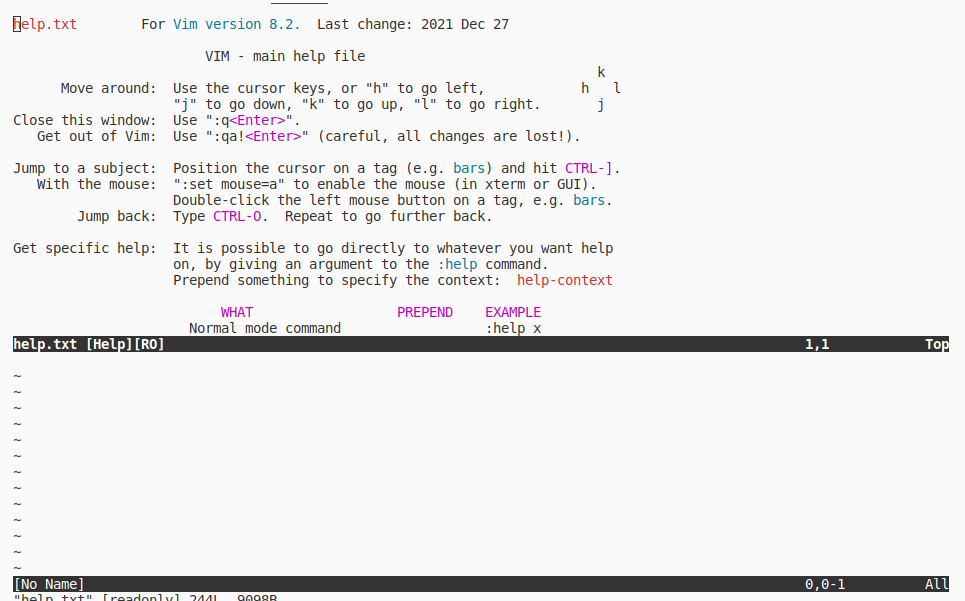
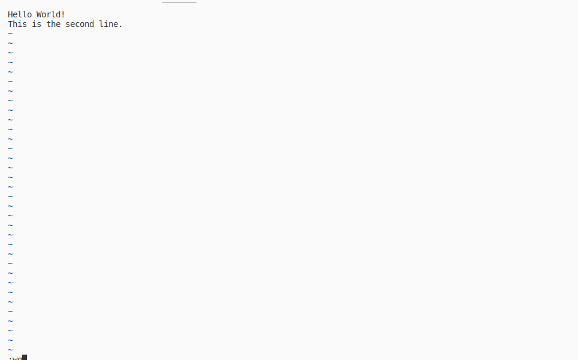
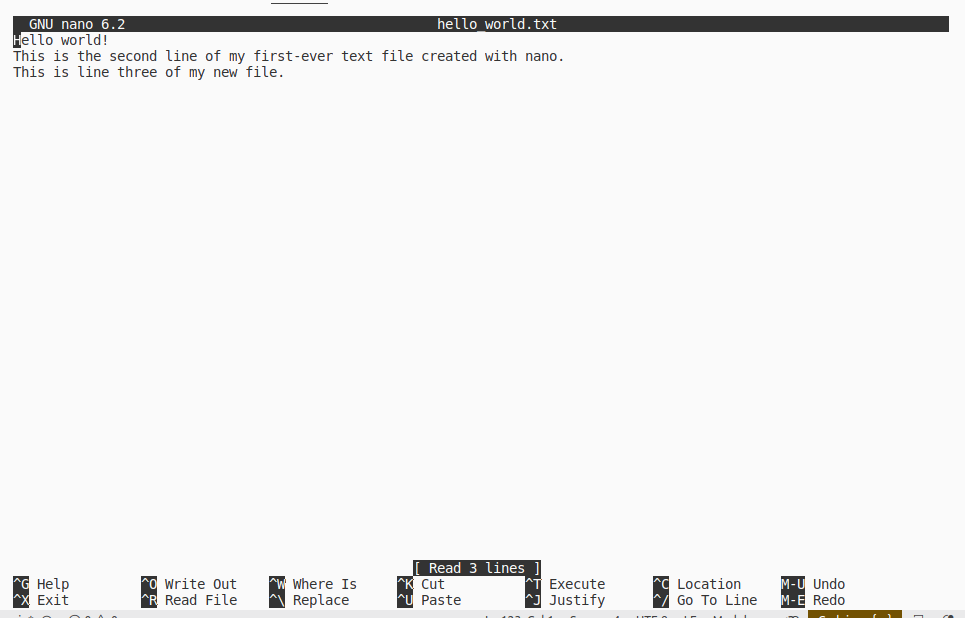

1. Reading: Browsing directories with the Linux terminal
```
$> pwd
/home/minhtam/workspace/DSLab/dslab-homework/homework2
$> ls
week1.md
$> ls /home
lost+found  minhtam
$> ls /
bin  boot  cdrom  dev  etc  home  lib  lib32  lib64  libx32  lost+found  media  mnt  opt  proc  root  run  sbin  snap  srv  sys  tmp  usr  var
```
2. Reading: Linus Terminal Tips
```
(base) minhtam@tammy:~$ cd Pictures/
(base) minhtam@tammy:~/Pictures$ cd ..
(base) minhtam@tammy:~$ cd Documents/
(base) minhtam@tammy:~$ cd Documents/python-examples/
(base) minhtam@tammy:~/Documents/python-examples$ python myprogram.py 
Hello, World
(base) minhtam@tammy:~/Documents/python-examples$ cd /
(base) minhtam@tammy:/$ 
```
3. Hands-on Lab: Getting Started with the Linux Terminal
- Exercise 1: 
```
1.1 
ls 
bin   cdrom  etc   lib    lib64   lost+found  mnt  proc  run   snap  sys  usr
boot  dev    home  lib32  libx32  media       opt  root  sbin  srv   tmp  var
1.2 
ls /
bin   cdrom  etc   lib    lib64   lost+found  mnt  proc  run   snap  sys  usr
boot  dev    home  lib32  libx32  media       opt  root  sbin  srv   tmp  var
ls /bin
#I would like not to paste in because it's too long
```
- Exercise 2: 
```
2.1 
cd ~
2.2
 cd ..
2.3 
 cd /
2.4
cd bin
2.5
 cd ~
2.6
cd workspace/
```
Exercise 3: Using tab completion and command history \n
It is just the usage of tab and up, down arrow \n

4. Practice exercise: 
```
1.
ls /
bin   cdrom  etc   lib    lib64   lost+found  mnt  proc  run   snap  sys  usr
boot  dev    home  lib32  libx32  media       opt  root  sbin  srv   tmp  var
2. 
cd ~
3. 
 pwd
/home/minhtam/theia
4.
cd bin
5. 
cd ~
```
5. Hands-on Lab: Getting Started with the Linux Terminal
- Exercise 1: 
```
1.1
sudo apt update
Hit:1 http://vn.archive.ubuntu.com/ubuntu jammy InRelease
Get:2 http://vn.archive.ubuntu.com/ubuntu jammy-updates InRelease [119 kB] 
Hit:3 https://dl.google.com/linux/chrome/deb stable InRelease                                 
Get:4 http://vn.archive.ubuntu.com/ubuntu jammy-backports InRelease [109 kB]                  
Hit:5 http://security.ubuntu.com/ubuntu jammy-security InRelease
Get:6 http://vn.archive.ubuntu.com/ubuntu jammy-updates/main amd64 DEP-11 Metadata [101 kB]
Get:7 http://vn.archive.ubuntu.com/ubuntu jammy-updates/universe amd64 DEP-11 Metadata [289 kB]
Get:8 http://vn.archive.ubuntu.com/ubuntu jammy-updates/multiverse amd64 DEP-11 Metadata [940 B]
Get:9 http://vn.archive.ubuntu.com/ubuntu jammy-backports/main amd64 DEP-11 Metadata [4.920 B]
Get:10 http://vn.archive.ubuntu.com/ubuntu jammy-backports/universe amd64 DEP-11 Metadata [16,6 kB]
Fetched 640 kB in 7s (90,5 kB/s)                                                              
Reading package lists... Done
Building dependency tree... Done
Reading state information... Done
69 packages can be upgraded. Run 'apt list --upgradable' to see them.
1.2
sudo apt upgrade nano
too long text ahihi
1.3
sudo apt install vim
too long text ahihi
```
- Exercise 2: 
```
2.1 
(base) minhtam@tammy:~$ mkdir project
cd project 
2.2 
nano hello_world.txt
2.3
cat hello_world.txt
Hello world!
This is the second line of my first-ever text file created with nano.
```
- Exercise 3
```
3.1
vim 

#When done reading
3.2
vim hello_world_2.txt

```
- Practice Exercises
```
1.
nano hello_world.txt

Ctrl X + Y+  Enter
2.
vim done.txt
I am done with the lab!
Insert + :wq
```

