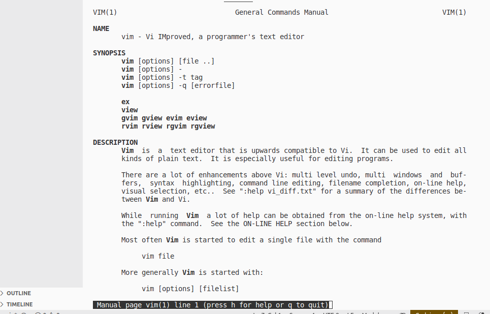
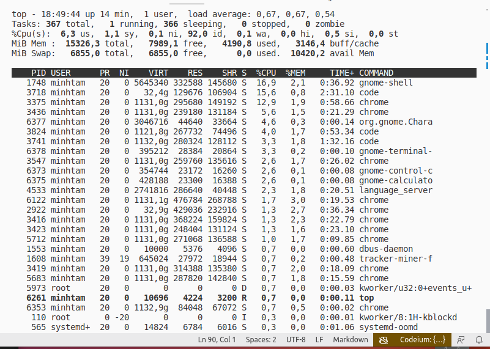
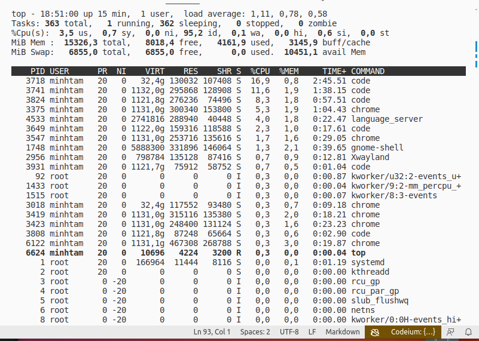
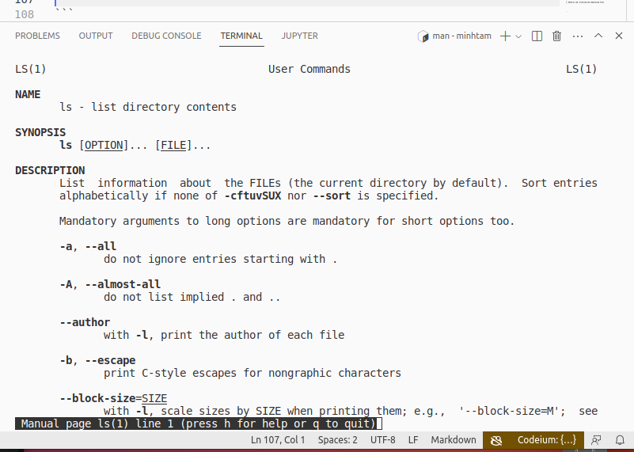
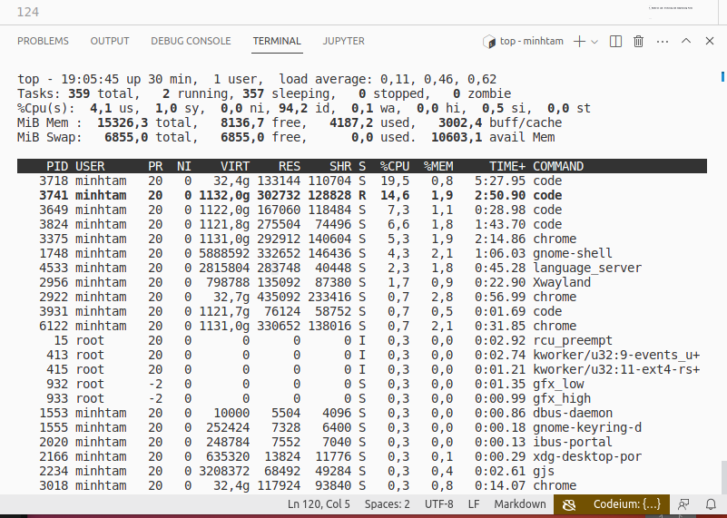
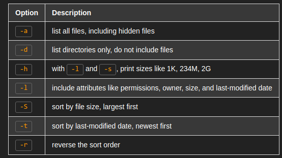
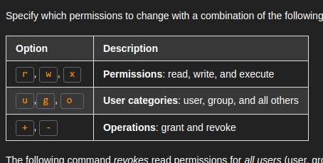
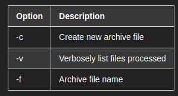

1. Reading: Getting Help for Linux Commands
```
1. 
$> apropos . 
#too long long text
$> man vim

2. 
$> sudo snap install  tldr
tldr 3.2.0 from K.B.Dharun Krishna (kbdk) installed
$> tldr vim

  vim

  Vim (Vi IMproved), a command-line text editor, provides several modes for different kinds of text manipulation.
  Pressing `i` in normal mode enters insert mode. Pressing `Esc` goes back to normal mode, which enables the use of Vim commands.
  See also `vimdiff`, `vimtutor`, `nvim`.
  More information: https://www.vim.org.

  - Open a file:
    vim path/to/file

  - Open a file at a specified line number:
    vim +line_number path/to/file

  - View Vim's help manual:
    :help<Enter>

  - Save and quit the current buffer:
    :wq<Enter>

  - Enter normal mode and undo the last operation:
    <ESC>u

  - Search for a pattern in the file (press `n`/`N` to go to next/previous match):
    /search_pattern<Enter>

  - Perform a regular expression substitution in the whole file:
    :%s/regular_expression/replacement/g<Enter>

  - Display the line numbers:
    :set nu<Enter>
```
2. Hands-on Lab: Informational Commands
- Exercise 1
```
1.1
$> whoami
minhtam
1.2
$> uname
Linux
$> uname -a
Linux tammy 6.2.0-26-generic #26~22.04.1-Ubuntu SMP PREEMPT_DYNAMIC Thu Jul 13 16:27:29 UTC 2 x86_64 x86_64 x86_64 GNU/Linux
# You will see system information listed in the following order:
# Kernel name, Network node hostname, Kernel release date, Kernel version
# Machine hardware name, Hardware platform, Operating system
1.3
$> id 
uid=1000(minhtam) gid=1000(minhtam) groups=1000(minhtam),4(adm),24(cdrom),27(sudo),30(dip),46(plugdev),122(lpadmin),134(lxd),135(sambashare)

1.4
$> df
Filesystem     1K-blocks     Used Available Use% Mounted on
tmpfs            1569412     2260   1567152   1% /run
/dev/nvme0n1p7  47745772 17319972  27967996  39% /
tmpfs            7847048   237592   7609456   4% /dev/shm
tmpfs               5120        4      5116   1% /run/lock
/dev/nvme0n1p1     98304    31805     66499  33% /boot/efi
/dev/nvme0n1p8  95535524 22675428  67960924  26% /home
tmpfs            1569408      116   1569292   1% /run/user/1000
$> df -h
Filesystem      Size  Used Avail Use% Mounted on
tmpfs           1,5G  2,3M  1,5G   1% /run
/dev/nvme0n1p7   46G   17G   27G  39% /
tmpfs           7,5G  233M  7,3G   4% /dev/shm
tmpfs           5,0M  4,0K  5,0M   1% /run/lock
/dev/nvme0n1p1   96M   32M   65M  33% /boot/efi
/dev/nvme0n1p8   92G   22G   65G  26% /home
tmpfs           1,5G  116K  1,5G   1% /run/user/1000
1.5
$> ps 
 PID TTY          TIME CMD
   3894 pts/0    00:00:00 bash
   5791 pts/0    00:00:00 ps
# display all of the processes running on the system
$> ps -e  
# too long long text
1.6
$> top

$> top -n 10

1.7
$> echo "Welcome to the linux lab"
Welcome to the linux lab
$> echo -e "This will be printed \nin two lines"
This will be printed 
in two lines
1.8
$> date
Thứ ba, 05 Tháng 9 năm 2023 18:53:12 +07
$>  date "+%D"
09/05/23
1.9
$> man ls

$> man -k .
# too long text
```
- Practice Exercise:
```
1. 
$> uname
Linux
2. 
$> ps -e
# too long long text
3. 
$> top 

Shift + m
4. 
$> date "+%T"
19:06:18
5. 
$> echo -e "Hello! \nGoodbye!"
Hello! 
Goodbye!
```
3. Hands-on Lab: Navigating and Managing Files and Directories
- Exercise 1: 
```
1.1
$> pwd  
/home/minhtam
1.2 
$> ls 
Desktop    Downloads          hello_world.txt  Music     snap       workspace
Documents  gensim-data        microsoft.gpg    Pictures  Templates
done.txt   hello_world_2.txt  miniconda3       Public    Videos
$> ls /bin
# too long long text
$> ls /bin/ls # = pwd
/bin/ls
$> ls /bin/b*
/bin/b2sum     /bin/bdftopcf          /bin/brltty        /bin/bunzip2  /bin/bzfgrep
/bin/baobab    /bin/bdftruncate       /bin/brltty-ctb    /bin/busctl   /bin/bzgrep
/bin/base32    /bin/bitmap            /bin/brltty-trtxt  /bin/busybox  /bin/bzip2
/bin/base64    /bin/bluemoon          /bin/brltty-ttb    /bin/bwrap    /bin/bzip2recover
/bin/basename  /bin/bluetoothctl      /bin/broadwayd     /bin/bzcat    /bin/bzless
/bin/basenc    /bin/bluetooth-sendto  /bin/browse        /bin/bzcmp    /bin/bzmore
/bin/bash      /bin/bmtoa             /bin/btattach      /bin/bzdiff
/bin/bashbug   /bin/boltctl           /bin/btmgmt        /bin/bzegrep
/bin/bc        /bin/bootctl           /bin/btmon         /bin/bzexe
$> ls /bin/*r
/bin/airscan-discover         /bin/gnome-disk-image-mounter  /bin/pasuspender
/bin/alsamixer                /bin/gnome-font-viewer         /bin/podchecker
/bin/amixer                   /bin/gnome-language-selector   /bin/pr
/bin/axfer                    /bin/gnome-system-monitor      /bin/ps2pdfwr
/bin/bzip2recover             /bin/gnome-terminal.wrapper    /bin/ptar
/bin/cautious-launcher        /bin/gnome-text-editor         /bin/pw-profiler
/bin/chattr                   /bin/gnome-www-browser         /bin/quirks-handler
/bin/clear                    /bin/gpgtar                    /bin/rdiffdir
/bin/colormgr                 /bin/gpg-wks-server            /bin/remmina-file-wrapper
/bin/dbus-monitor             /bin/gpu-manager               /bin/rmdir
/bin/deb-systemd-helper       /bin/grub-mknetdir             /bin/sane-find-scanner
/bin/dir                      /bin/hp-config_usb_printer     /bin/select-editor
/bin/dirmngr                  /bin/hp-doctor                 /bin/sensible-browser
/bin/dpkg-maintscript-helper  /bin/ijs_pxljr                 /bin/sensible-editor
/bin/dpkg-trigger             /bin/infobrowser               /bin/sensible-pager
/bin/editor                   /bin/install-printerdriver     /bin/spa-monitor
/bin/efibootmgr               /bin/isdv4-serial-debugger     /bin/speech-dispatcher
/bin/evince-previewer         /bin/ispell-wrapper            /bin/sqfstar
/bin/evince-thumbnailer       /bin/linux-boot-prober         /bin/system-config-printer
/bin/expr                     /bin/logger                    /bin/tar
/bin/factor                   /bin/lowriter                  /bin/totem-video-thumbnailer
/bin/file-roller              /bin/lpr                       /bin/tr
/bin/foo2ddst-wrapper         /bin/lsattr                    /bin/ubuntu-core-launcher
/bin/foo2hbpl2-wrapper        /bin/lwp-mirror                /bin/ucfr
/bin/foo2hiperc-wrapper       /bin/m2300w-wrapper            /bin/unity-scope-loader
/bin/foo2hp2600-wrapper       /bin/mako-render               /bin/update-manager
/bin/foo2lava-wrapper         /bin/mkdir                     /bin/update-notifier
/bin/foo2oak-wrapper          /bin/mkfontdir                 /bin/upower
/bin/foo2qpdl-wrapper         /bin/monitor-sensor            /bin/vdir
/bin/foo2slx-wrapper          /bin/mtr                       /bin/vimtutor
/bin/foo2xqx-wrapper          /bin/networkd-dispatcher       /bin/xdg-screensaver
/bin/foo2zjs-wrapper          /bin/nm-connection-editor      /bin/xdg-user-dir
/bin/fuser                    /bin/nsenter                   /bin/Xephyr
/bin/fwupdmgr                 /bin/ntfscluster               /bin/xrandr
/bin/gcr-viewer               /bin/ntfsrecover               /bin/x-session-manager
/bin/gdk-pixbuf-thumbnailer   /bin/nvidia-detector           /bin/xsetpointer
/bin/gdmflexiserver           /bin/on_ac_power               /bin/x-terminal-emulator
/bin/gnome-calculator         /bin/orca-dm-wrapper           /bin/x-www-browser
/bin/gnome-calendar           /bin/os-prober
/bin/gnome-control-center     /bin/pager
$> ls -l
total 60
drwxr-xr-x  2 minhtam minhtam 4096 Thg 7  21 23:23 Desktop
drwxr-xr-x  3 minhtam minhtam 4096 Thg 9   5 16:22 Documents
-rw-rw-r--  1 minhtam minhtam   24 Thg 9   5 17:54 done.txt
drwxr-xr-x  2 minhtam minhtam 4096 Thg 9   5 18:39 Downloads
drwxrwxr-x  2 minhtam minhtam 4096 Thg 8   7 16:00 gensim-data
-rw-rw-r--  1 minhtam minhtam   38 Thg 9   5 17:17 hello_world_2.txt
-rw-rw-r--  1 minhtam minhtam  118 Thg 9   5 17:20 hello_world.txt
-rw-rw-r--  1 minhtam minhtam    0 Thg 7  27 16:41 microsoft.gpg
drwxrwxr-x 18 minhtam minhtam 4096 Thg 7  27 10:23 miniconda3
drwxr-xr-x  2 minhtam minhtam 4096 Thg 7  21 23:23 Music
drwxr-xr-x  3 minhtam minhtam 4096 Thg 7  23 22:19 Pictures
drwxr-xr-x  2 minhtam minhtam 4096 Thg 7  21 23:23 Public
drwx------  8 minhtam minhtam 4096 Thg 9   5 18:29 snap
drwxr-xr-x  2 minhtam minhtam 4096 Thg 7  21 23:23 Templates
drwxr-xr-x  2 minhtam minhtam 4096 Thg 7  21 23:23 Videos
drwxrwxr-x  5 minhtam minhtam 4096 Thg 8  26 17:47 workspace
```

- Exercise 2
```
2.1
$> mkdir scripts
$> ls
Desktop    Downloads          hello_world.txt  Music     scripts    Videos
Documents  gensim-data        microsoft.gpg    Pictures  snap       workspace
done.txt   hello_world_2.txt  miniconda3       Public    Templates
2.2
$> cd scripts
~/scripts$ pwd
/home/minhtam/scripts
~/scripts$ cd 
$> pwd
/home/minhtam
$> cd ..
2.3
cd 
$> touch myfile.txt
$> ls
Desktop    Downloads          hello_world.txt  Music       Public   Templates
Documents  gensim-data        microsoft.gpg    myfile.txt  scripts  Videos
done.txt   hello_world_2.txt  miniconda3       Pictures    snap     workspace
$> touch myfile.txt
$> date -r myfile.txt
Thứ ba, 05 Tháng 9 năm 2023 19:21:45 +07
```
- Exercise 3
```
3.1
$> find /home/minhtam/workspace/DSLab/dslab-homework/homework2/week2 -name *.png
/home/minhtam/workspace/DSLab/dslab-homework/homework2/week2/image-2.png
/home/minhtam/workspace/DSLab/dslab-homework/homework2/week2/image-3.png
/home/minhtam/workspace/DSLab/dslab-homework/homework2/week2/image.png
/home/minhtam/workspace/DSLab/dslab-homework/homework2/week2/image-4.png
/home/minhtam/workspace/DSLab/dslab-homework/homework2/week2/image-1.png
/home/minhtam/workspace/DSLab/dslab-homework/homework2/week2/image-5.png
3.2
$> rm -i myfile.txt
$> rm: remove regular empty file 'myfile.txt'? y
$> ls -a
.              .config      .gnupg         .pki                       Templates
..             Desktop      .ipython       .profile                   Videos
.bash_history  Documents    .lesshst       Public                     .viminfo
.bash_logout   .dotnet      .local         .python_history            .vscode
.bashrc        Downloads    microsoft.gpg  scripts                    workspace
.cache         gensim-data  miniconda3     snap
.codeium       .gitconfig   Music          .ssh
.conda         .gnome       Pictures       .sudo_as_admin_successful
3.3
$> touch users.txt
$> mv users.txt user-info.txt
ls -a
.              .config      .gnupg         .pki                       Templates
..             Desktop      .ipython       .profile                   user-info.txt
.bash_history  Documents    .lesshst       Public                     Videos
.bash_logout   .dotnet      .local         .python_history            .viminfo
.bashrc        Downloads    microsoft.gpg  scripts                    .vscode
.cache         gensim-data  miniconda3     snap                       workspace
.codeium       .gitconfig   Music          .ssh
.conda         .gnome       Pictures       .sudo_as_admin_successful
$> mv user-info.txt /tmp
$> ls -a
.              .config      .gnupg         .pki                       Templates
..             Desktop      .ipython       .profile                   tmp
.bash_history  Documents    .lesshst       Public                     Videos
.bash_logout   .dotnet      .local         .python_history            .viminfo
.bashrc        Downloads    microsoft.gpg  scripts                    .vscode
.cache         gensim-data  miniconda3     snap                       workspace
.codeium       .gitconfig   Music          .ssh
.conda         .gnome       Pictures       .sudo_as_admin_successful
$> ls -l /tmp
total 84
drwxrwxr-x 3 minhtam minhtam 4096 Thg 9   5 18:36 05b2366f-8095-495b-b41a-26586599a095
drwxrwxr-x 3 minhtam minhtam 4096 Thg 9   5 23:00 d706ce43-e9c7-4e5b-a93b-403b27b2e887
drwx------ 4 root    root    4096 Thg 9   5 18:35 snap-private-tmp
drwx------ 3 root    root    4096 Thg 9   5 18:35 systemd-private-852c7877e1954fb3b805372125f12be7-bluetooth.service-0IuSaL
drwx------ 3 root    root    4096 Thg 9   5 18:35 systemd-private-852c7877e1954fb3b805372125f12be7-colord.service-dbAvva
drwx------ 3 root    root    4096 Thg 9   5 18:35 systemd-private-852c7877e1954fb3b805372125f12be7-fwupd.service-bgwSbc
drwx------ 3 root    root    4096 Thg 9   5 18:35 systemd-private-852c7877e1954fb3b805372125f12be7-ModemManager.service-1LwnvT
drwx------ 3 root    root    4096 Thg 9   5 18:35 systemd-private-852c7877e1954fb3b805372125f12be7-power-profiles-daemon.service-AMBHCy
drwx------ 3 root    root    4096 Thg 9   5 18:35 systemd-private-852c7877e1954fb3b805372125f12be7-switcheroo-control.service-qmPuO2
drwx------ 3 root    root    4096 Thg 9   5 18:35 systemd-private-852c7877e1954fb3b805372125f12be7-systemd-logind.service-YMDGjM
drwx------ 3 root    root    4096 Thg 9   5 18:35 systemd-private-852c7877e1954fb3b805372125f12be7-systemd-oomd.service-6iDth0
drwx------ 3 root    root    4096 Thg 9   5 18:35 systemd-private-852c7877e1954fb3b805372125f12be7-systemd-resolved.service-mQvO9b
drwx------ 3 root    root    4096 Thg 9   5 18:35 systemd-private-852c7877e1954fb3b805372125f12be7-systemd-timesyncd.service-rSVqDo
drwx------ 3 root    root    4096 Thg 9   5 18:35 systemd-private-852c7877e1954fb3b805372125f12be7-upower.service-o23zE0
drwx------ 2 minhtam minhtam 4096 Thg 9   5 19:16 tracker-extract-3-files.1000
drwx------ 2 gdm     gdm     4096 Thg 9   5 18:35 tracker-extract-3-files.127
-rw-rw-r-- 1 minhtam minhtam 7861 Thg 9   5 23:01 unleash-backup-codeium-extension.json
-rw-rw-r-- 1 minhtam minhtam 7043 Thg 9   5 23:01 unleash-repo-schema-v1-codeium-language-server.json
-rw-rw-r-- 1 minhtam minhtam    0 Thg 9   5 22:56 user-info.txt
drwxrwxr-x 2 minhtam minhtam 4096 Thg 9   5 22:59 vscode-typescript1000
3.4 
$>  cp /tmp/user-info.txt user-info.txt
$> ls -a
.              .config      .gnupg         .pki                       Templates
..             Desktop      .ipython       .profile                   tmp
.bash_history  Documents    .lesshst       Public                     user-info.txt
.bash_logout   .dotnet      .local         .python_history            Videos
.bashrc        Downloads    microsoft.gpg  scripts                    .viminfo
.cache         gensim-data  miniconda3     snap                       .vscode
.codeium       .gitconfig   Music          .ssh                       workspace
.conda         .gnome       Pictures       .sudo_as_admin_successful
```
- Practice Exercises: 
```
1. 
$> ls /home
lost+found  minhtam
2.
$> cd ~
$> pwd
/home/minhtam
3. 
$> mkdir tmp
4.
$> cd tmp
$>  touch display.sh
$>  ls -l
total 0
-rw-rw-r-- 1 minhtam minhtam 0 Thg 9   5 23:05 display.sh
5.
$> cp display.sh report.sh
6.
$> mv report.sh ../
$> ls -a
.  ..  display.sh
$>  ls ../
Desktop    gensim-data    Music     report.sh  Templates      Videos
Documents  microsoft.gpg  Pictures  scripts    tmp            workspace
Downloads  miniconda3     Public    snap       user-info.txt
7.
$> rm display.sh
8.
$> ls -ltr /etc/
9.
$> cp /var/log/bootstrap.log .
```
4. Reading: Security - Managing File Permissions and Ownership
```
$> echo "Who can read this file?" > my_new_file
$> more my_new_file 
Who can read this file?
$>  ls -l my_new_file 
-rw-rw-r-- 1 minhtam minhtam 24 Thg 9   5 23:11 my_new_file
chmod go-r my_new_file
$>  ls -l my_new_file 
-rw--w---- 1 minhtam minhtam 24 Thg 9   5 23:11 my_new_file
```
5. Hands-on Lab: Access Control Commands
- Exercise 1: 
```
1.1 
$> cd project
wget https://cf-courses-data.s3.us.cloud-object-storage.appdomain.cloud/IBM-LX0117EN-SkillsNetwork/labs/module%201/usdoi.txt
--2023-09-05 23:18:55--  https://cf-courses-data.s3.us.cloud-object-storage.appdomain.cloud/IBM-LX0117EN-SkillsNetwork/labs/module%201/usdoi.txt
Resolving cf-courses-data.s3.us.cloud-object-storage.appdomain.cloud (cf-courses-data.s3.us.cloud-object-storage.appdomain.cloud)... 169.63.118.104
Connecting to cf-courses-data.s3.us.cloud-object-storage.appdomain.cloud (cf-courses-data.s3.us.cloud-object-storage.appdomain.cloud)|169.63.118.104|:443... connected.
HTTP request sent, awaiting response... 200 OK
Length: 8121 (7,9K) [text/plain]
Saving to: ‘usdoi.txt’

usdoi.txt              100%[=========================>]   7,93K  --.-KB/s    in 0s      

2023-09-05 23:18:58 (2,01 GB/s) - ‘usdoi.txt’ saved [8121/8121]
$> ls -l usdoi.txt
-rw-rw-r-- 1 minhtam minhtam 8121 Thg 9  28  2022 usdoi.txt
1.2
$> chmod -r usdoi.txt
$>  ls -l usdoi.txt
--w--w---- 1 minhtam minhtam 8121 Thg 9  28  2022 usdoi.txt
$> chmod +r usdoi.txt
$>  ls -l usdoi.txt
-rw-rw-r-- 1 minhtam minhtam 8121 Thg 9  28  2022 usdoi.txt
$> chmod o-r usdoi.txt
$> ls -l usdoi.txt
-rw-rw---- 1 minhtam minhtam 8121 Thg 9  28  2022 usdoi.txt

```
- Exercise 2
```
2.1
$> mkdir test
$> ls -l
total 12
drwxrwxr-x 2 minhtam minhtam 4096 Thg 9   5 23:23 test
-rw-rw---- 1 minhtam minhtam 8121 Thg 9  28  2022 usdoi.txt
2.2
$> chmod u-x test
$>  cd test
bash: cd: test: Permission denied
$> mkdir test/test3
mkdir: cannot create directory ‘test/test3’: Permission denied
$>  cd test
bash: cd: test: Permission denied
$>  chmod u+x test
$>  chmod u-x test
$>  ls -l
total 12
drw-rwxr-x 2 minhtam minhtam 4096 Thg 9   5 23:23 test
-rw-rw---- 1 minhtam minhtam 8121 Thg 9  28  2022 usdoi.txt
$>  cd test
bash: cd: test: Permission denied
$>  mkdir test_again
```
- Practice exercise 
```
1.
$> ls -l usdoi.txt
-rw-rw---- 1 minhtam minhtam 8121 Thg 9  28  2022 usdoi.txt
2.
$> chmod u-w usdoi.txt
3.
$> rm usdoi.txt 
rm: remove write-protected regular file 'usdoi.txt'? y
4.
$> mkdir tmp_dir
5.
$>  ls -ld tmp_dir
drwxrwxr-x 2 minhtam minhtam 4096 Thg 9   5 23:32 tmp_dir
6.
$> chmod u-w tmp_dir
7.
$> cd tmp_dir
$> mkdir sub_dir
mkdir: cannot create directory ‘sub_dir’: Permission denied
```
6. Hands-on Lab: Wrangling Text Files at the Command Line 
- Exercise 1
```
$> cd ~
1.1
$> cat entrypoint.sh
#!/bin/bash

if [ -f "$IBMCLOUD_API_KEY_LOCATION" ]; then
  export IBMCLOUD_API_KEY=$(cat $IBMCLOUD_API_KEY_LOCATION)
fi

if [[ ! -z ${IBMCLOUD_API_KEY+x} && "${PRELAUNCH_K8S}" == "true"  ]]; then
  ibmcloud login -r us-south

  echo "Waiting for ${DOCKER_CERT_PATH}/ca.pem"
  timeout=5
  until [ -f ${DOCKER_CERT_PATH}/ca.pem ]
  do
    if [ "$timeout" == 0 ]; then
      echo "ERROR: Timeout while waiting for the file ${DOCKER_CERT_PATH}/ca.pem"
      break
    fi
    sleep 2
    echo "waiting..."
    ((timeout--))
  done

  if [ "$timeout" != 0 ]; then
    echo "${DOCKER_CERT_PATH}/ca.pem found"
    ibmcloud cr login
  fi

  # Set SN_ICR_NAMESPACE for the user
  export SN_ICR_NAMESPACE=$(ibmcloud cr namespace-list | grep sn-labs- | xargs)

  # This will upsert the "icr" secret
  kubectl create secret docker-registry icr --docker-server=us.icr.io --docker-username=iamapikey --docker-password=$IBMCLOUD_API_KEY -o yaml --save-config --dry-run=client | kubectl apply -f -

  # Set the SN context
  export SN_KUBECTL_CONTEXT=$(kubectl config current-context)

  if [ -z ${SN_ICR_NAMESPACE+x} ]; then
    echo "ERROR: SN_ICR_NAMESPACE not set"
    exit 1
  fi
fi

if [ ! -z ${DHT+x} ]; then
  DHT_DECODED=$(echo $DHT | base64 -d)
  DHT_PARTS=(${DHT_DECODED//:/ })

  docker login -u ${DHT_PARTS[0]} -p ${DHT_PARTS[1]}
  kubectl create secret docker-registry dh --docker-server=index.docker.io/v2 --docker-username=${DHT_PARTS[0]} --docker-password=${DHT_PARTS[1]}
fi

$> chmod go-r /etc/kube/config

export MONGO_PASSWORD="$(echo "$RANDOM-$USERNAME-$RANDOM" | base64 | cut -c1-16)"
export CASSANDRA_PASSWORD="$(echo "$RANDOM-$USERNAME-$RANDOM" | base64 | cut -c1-16)"
export MYSQL_PASSWORD="$(echo "$RANDOM-$USERNAME-$RANDOM" | base64 | cut -c1-16)"
export POSTGRES_PASSWORD="$(echo "$RANDOM-$USERNAME-$RANDOM" | base64 | cut -c1-16)"
export PGPASSWORD="$POSTGRES_PASSWORD"
export AIRFLOW_PASSWORD="$(echo "$RANDOM-$USERNAME-$RANDOM" | base64 | cut -c1-16)"
export _AIRFLOW_WWW_USER_PASSWORD="$AIRFLOW_PASSWORD"

export PATH=$PATH:/home/theia/.local/bin

sudo service cron start

yarn theia start /home/project --hostname=0.0.0.0 --port=$THEIA_LOCAL_PORT
1.2
$> cat entrypoint.sh
#!/bin/bash

if [ -f "$IBMCLOUD_API_KEY_LOCATION" ]; then
  export IBMCLOUD_API_KEY=$(cat $IBMCLOUD_API_KEY_LOCATION)
fi

if [[ ! -z ${IBMCLOUD_API_KEY+x} && "${PRELAUNCH_K8S}" == "true"  ]]; then
  ibmcloud login -r us-south

  echo "Waiting for ${DOCKER_CERT_PATH}/ca.pem"
  timeout=5
  until [ -f ${DOCKER_CERT_PATH}/ca.pem ]
  do
    if [ "$timeout" == 0 ]; then
      echo "ERROR: Timeout while waiting for the file ${DOCKER_CERT_PATH}/ca.pem"
      break
    fi
    sleep 2
    echo "waiting..."
    ((timeout--))
  done

  if [ "$timeout" != 0 ]; then
    echo "${DOCKER_CERT_PATH}/ca.pem found"
    ibmcloud cr login
  fi

  # Set SN_ICR_NAMESPACE for the user
  export SN_ICR_NAMESPACE=$(ibmcloud cr namespace-list | grep sn-labs- | xargs)

  # This will upsert the "icr" secret
  kubectl create secret docker-registry icr --docker-server=us.icr.io --docker-username=iamapikey --docker-password=$IBMCLOUD_API_KEY -o yaml --save-config --dry-run=client | kubectl apply -f -

  # Set the SN context
  export SN_KUBECTL_CONTEXT=$(kubectl config current-context)

  if [ -z ${SN_ICR_NAMESPACE+x} ]; then
    echo "ERROR: SN_ICR_NAMESPACE not set"
    exit 1
  fi
fi

if [ ! -z ${DHT+x} ]; then
  DHT_DECODED=$(echo $DHT | base64 -d)
  DHT_PARTS=(${DHT_DECODED//:/ })

  docker login -u ${DHT_PARTS[0]} -p ${DHT_PARTS[1]}
  kubectl create secret docker-registry dh --docker-server=index.docker.io/v2 --docker-username=${DHT_PARTS[0]} --docker-password=${DHT_PARTS[1]}
fi

$> chmod go-r /etc/kube/config

export MONGO_PASSWORD="$(echo "$RANDOM-$USERNAME-$RANDOM" | base64 | cut -c1-16)"
export CASSANDRA_PASSWORD="$(echo "$RANDOM-$USERNAME-$RANDOM" | base64 | cut -c1-16)"
export MYSQL_PASSWORD="$(echo "$RANDOM-$USERNAME-$RANDOM" | base64 | cut -c1-16)"
export POSTGRES_PASSWORD="$(echo "$RANDOM-$USERNAME-$RANDOM" | base64 | cut -c1-16)"
export PGPASSWORD="$POSTGRES_PASSWORD"
export AIRFLOW_PASSWORD="$(echo "$RANDOM-$USERNAME-$RANDOM" | base64 | cut -c1-16)"
export _AIRFLOW_WWW_USER_PASSWORD="$AIRFLOW_PASSWORD"

export PATH=$PATH:/home/theia/.local/bin

sudo service cron start

yarn theia start /home/project --hostname=0.0.0.0 --port=$THEIA_LOCAL_PORT
1.3
$> less entrypoint.sh
#!/bin/bash

if [ -f "$IBMCLOUD_API_KEY_LOCATION" ]; then
  export IBMCLOUD_API_KEY=$(cat $IBMCLOUD_API_KEY_LOCATION)
fi

if [[ ! -z ${IBMCLOUD_API_KEY+x} && "${PRELAUNCH_K8S}" == "true"  ]]; then
  ibmcloud login -r us-south

  echo "Waiting for ${DOCKER_CERT_PATH}/ca.pem"
  timeout=5
  until [ -f ${DOCKER_CERT_PATH}/ca.pem ]
  do
    if [ "$timeout" == 0 ]; then
      echo "ERROR: Timeout while waiting for the file ${DOCKER_CERT_PATH}/ca.pem"
      break
    fi
    sleep 2
    echo "waiting..."
    ((timeout--))
  done

  if [ "$timeout" != 0 ]; then
    echo "${DOCKER_CERT_PATH}/ca.pem found"
    ibmcloud cr login
  fi

  # Set SN_ICR_NAMESPACE for the user
  export SN_ICR_NAMESPACE=$(ibmcloud cr namespace-list | grep sn-labs- | xargs)

  # This will upsert the "icr" secret
  kubectl create secret docker-registry icr --docker-server=us.icr.io --docker-username=iamapikey --docker-password=$IBMCLOUD_API_KEY -o yaml --save-config --dry-run=client | kubectl apply -f -

  # Set the SN context
  export SN_KUBECTL_CONTEXT=$(kubectl config current-context)

  if [ -z ${SN_ICR_NAMESPACE+x} ]; then
    echo "ERROR: SN_ICR_NAMESPACE not set"
    exit 1
  fi
fi

if [ ! -z ${DHT+x} ]; then
  DHT_DECODED=$(echo $DHT | base64 -d)
  DHT_PARTS=(${DHT_DECODED//:/ })

  docker login -u ${DHT_PARTS[0]} -p ${DHT_PARTS[1]}
  kubectl create secret docker-registry dh --docker-server=index.docker.io/v2 --docker-username=${DHT_PARTS[0]} --docker-password=${DHT_PARTS[1]}
fi

```
- Exercise 2
```
$> cd project
$> wget https://cf-courses-data.s3.us.cloud-object-storage.appdomain.cloud/IBM-DB0250EN-SkillsNetwork/labs/Bash%20Scripting/usdoi.txt
--2023-09-05 12:50:19--  https://cf-courses-data.s3.us.cloud-object-storage.appdomain.cloud/IBM-DB0250EN-SkillsNetwork/labs/Bash%20Scripting/usdoi.txt
Resolving cf-courses-data.s3.us.cloud-object-storage.appdomain.cloud (cf-courses-data.s3.us.cloud-object-storage.appdomain.cloud)... 169.63.118.104
Connecting to cf-courses-data.s3.us.cloud-object-storage.appdomain.cloud (cf-courses-data.s3.us.cloud-object-storage.appdomain.cloud)|169.63.118.104|:443... connected.
HTTP request sent, awaiting response... 200 OK
Length: 8121 (7.9K) [text/plain]
Saving to: ‘usdoi.txt’

usdoi.txt     100%   7.93K  --.-KB/s    in 0s          

2023-09-05 12:50:19 (1.10 GB/s) - ‘usdoi.txt’ saved [8121/8121]
2.1
$> head usdoi.txt
The unanimous Declaration of the thirteen united States of America, When in the
Course of human events, it becomes necessary for one people to dissolve the
political bands which have connected them with another, and to assume among the
powers of the earth, the separate and equal station to which the Laws of Nature
and of Nature's God entitle them, a decent respect to the opinions of mankind
requires that they should declare the causes which impel them to the
separation.

We hold these truths to be self-evident, that all men are created equal, that
they are endowed by their Creator with certain unalienable Rights, that among
$>  head -3 usdoi.txt
The unanimous Declaration of the thirteen united States of America, When in the
Course of human events, it becomes necessary for one people to dissolve the
political bands which have connected them with another, and to assume among the
2.2
$> tail usdoi.txt
People of these Colonies, solemnly publish and declare, That these United
Colonies are, and of Right ought to be Free and Independent States; that they
are Absolved from all Allegiance to the British Crown, and that all political
connection between them and the State of Great Britain, is and ought to be
totally dissolved; and that as Free and Independent States, they have full
Power to levy War, conclude Peace, contract Alliances, establish Commerce, and
to do all other Acts and Things which Independent States may of right do. And
for the support of this Declaration, with a firm reliance on the protection of
divine Providence, we mutually pledge to each other our Lives, our Fortunes and
our sacred Honor.
$>  tail -2 usdoi.txt
divine Providence, we mutually pledge to each other our Lives, our Fortunes and
our sacred Honor.
``` 
- Exercise 3
```
$> wc usdoi.txt
 152 1330 8121 usdoi.txt
$>  wc -l usdoi.txt
152 usdoi.txt
$>  wc -w usdoi.txt
1330 usdoi.txt
$>  wc -c usdoi.txt
8121 usdoi.txt
```
- Exercise 4
```
4.1
$> sort usdoi.txt
#too long long text
$> sort -r usdoi.txt
#too long long text
4.2
$> wget https://cf-courses-data.s3.us.cloud-object-storage.appdomain.cloud/IBM-LX0117EN-SkillsNetwork/labs/module%201/zoo.txt
--2023-09-05 12:56:02--  https://cf-courses-data.s3.us.cloud-object-storage.appdomain.cloud/IBM-LX0117EN-SkillsNetwork/labs/module%201/zoo.txt
Resolving cf-courses-data.s3.us.cloud-object-storage.appdomain.cloud (cf-courses-data.s3.us.cloud-object-storage.appdomain.cloud)... 169.63.118.104
Connecting to cf-courses-data.s3.us.cloud-object-storage.appdomain.cloud (cf-courses-data.s3.us.cloud-object-storage.appdomain.cloud)|169.63.118.104|:443... connected.
HTTP request sent, awaiting response... 200 OK
Length: 54 [text/plain]
Saving to: ‘zoo.txt’

zoo.txt                    100%[=====================================>]      54  --.-KB/s    in 0s      

2023-09-05 12:56:02 (9.41 MB/s) - ‘zoo.txt’ saved [54/54]
$> cat zoo.txt
zebra
zebra
lion
lion
anaconda
zebra
zebra
lion
zebra
$>  uniq zoo.txt
zebra
lion
anaconda
zebra
lion
zebra
```
- Exercise 5: 
```
5.1
$> grep people usdoi.txt
Course of human events, it becomes necessary for one people to dissolve the
people, unless those people would relinquish the right of Representation in the
firmness his invasions on the rights of the people.
to harrass our people, and eat out their substance.
the lives of our people.
Tyrant, is unfit to be the ruler of a free people.
$>  grep -v login /etc/passwd
root:x:0:0:root:/root:/bin/bash
sync:x:4:65534:sync:/bin:/bin/sync
theia:x:1000:1000:,,,:/home/theia:/bin/bash
postgres:x:105:109:PostgreSQL administrator,,,:/var/lib/postgresql:/bin/bash
5.2
$> cut -c -2 zoo.txt
ze
ze
li
li
an
ze
ze
li
ze
$>  cut -c 2- zoo.txt
ebra
ebra
ion
ion
naconda
ebra
ebra
ion
ebra
$>  wget https://cf-courses-data.s3.us.cloud-object-storage.appdomain.cloud/IBM-LX0117EN-SkillsNetwork/labs/v4_new_content/labs/names_and_numbers.csv
--2023-09-05 13:06:50--  https://cf-courses-data.s3.us.cloud-object-storage.appdomain.cloud/IBM-LX0117EN-SkillsNetwork/labs/v4_new_content/labs/names_and_numbers.csv
Resolving cf-courses-data.s3.us.cloud-object-storage.appdomain.cloud (cf-courses-data.s3.us.cloud-object-storage.appdomain.cloud)... 169.63.118.104
Connecting to cf-courses-data.s3.us.cloud-object-storage.appdomain.cloud (cf-courses-data.s3.us.cloud-object-storage.appdomain.cloud)|169.63.118.104|:443... connected.
HTTP request sent, awaiting response... 200 OK
Length: 42 [text/csv]
Saving to: ‘names_and_numbers.csv’

names_and_numbers.csv      100%[=====================================>]      42  --.-KB/s    in 0s      

2023-09-05 13:06:50 (6.95 MB/s) - ‘names_and_numbers.csv’ saved [42/42]

$>  cat names_and_numbers.csv 
John Fogerty, 555-1212
Jane Doe, 555-1312
#-d "," tells the command that the delimiter is a comma, and -f2 tells it to extract the second field.
$>  cut -d ',' -f2 names_and_numbers.csv 
 555-1212
 555-1312
```
- Exercise 6
```
$> wget https://cf-courses-data.s3.us.cloud-object-storage.appdomain.cloud/IBM-LX0117EN-SkillsNetwork/labs/module%201/zoo_ages.txt
--2023-09-05 13:12:18--  https://cf-courses-data.s3.us.cloud-object-storage.appdomain.cloud/IBM-LX0117EN-SkillsNetwork/labs/module%201/zoo_ages.txt
Resolving cf-courses-data.s3.us.cloud-object-storage.appdomain.cloud (cf-courses-data.s3.us.cloud-object-storage.appdomain.cloud)... 169.63.118.104
Connecting to cf-courses-data.s3.us.cloud-object-storage.appdomain.cloud (cf-courses-data.s3.us.cloud-object-storage.appdomain.cloud)|169.63.118.104|:443... connected.
HTTP request sent, awaiting response... 200 OK
Length: 20 [text/plain]
Saving to: ‘zoo_ages.txt’

zoo_ages.txt  100%      20  --.-KB/s    in 0s          

2023-09-05 13:12:18 (3.02 MB/s) - ‘zoo_ages.txt’ saved [20/20]

$>  paste zoo.txt zoo_ages.txt
zebra   17
zebra   12
lion    7
lion    4
anaconda        3
zebra   4
zebra   1
lion    0
zebra   1
$>  paste -d "," zoo.txt zoo_ages.txt
zebra,17
zebra,12
lion,7
lion,4
anaconda,3
zebra,4
zebra,1
lion,0
zebra,1
```
- Practice Exercise
```
1. 
$> wc -l /etc/passwd 
25 /etc/passwd
2.
$> grep "not installed" /var/log/bootstrap.log
  Package libc6 is not installed.
  Package libdebconfclient0 is not installed.
  awk is not installed.
  Package awk is not installed.
  libbz2-1.0 is not installed.
  libc6 is not installed.
  liblzma5 is not installed.
  libselinux1 is not installed.
  libzstd1 is not installed.
  zlib1g is not installed.
  Package libbz2-1.0 is not installed.
  Package libc6 is not installed.
  Package liblzma5 is not installed.
  Package libselinux1 is not installed.
  Package libzstd1 is not installed.
  Package zlib1g is not installed.
  Package tar is not installed.
  Package libgcc1 is not installed.
  libtinfo5 is not installed.
  libsystemd0 is not installed.
  libacl1 is not installed.
  libattr1 is not installed.
  libselinux1 is not installed.
  libbz2-1.0 is not installed.
  liblzma5 is not installed.
  libselinux1 is not installed.
  libzstd1 is not installed.
  zlib1g is not installed.
  libblkid1 is not installed.
  libcom-err2 is not installed.
  libext2fs2 is not installed.
  libss2 is not installed.
  libuuid1 is not installed.
  libselinux1 is not installed.
  libpcre3 is not installed.
  libpam0g is not installed.
  libselinux1 is not installed.
  libpam-modules-bin is not installed.
  zlib1g is not installed.
3.
$> wget https://cf-courses-data.s3.us.cloud-object-storage.appdomain.cloud/IBM-DB0250EN-SkillsNetwork/labs/Bash%20Scripting/top-sites.txt
--2023-09-05 13:15:55--  https://cf-courses-data.s3.us.cloud-object-storage.appdomain.cloud/IBM-DB0250EN-SkillsNetwork/labs/Bash%20Scripting/top-sites.txt
Resolving cf-courses-data.s3.us.cloud-object-storage.appdomain.cloud (cf-courses-data.s3.us.cloud-object-storage.appdomain.cloud)... 169.63.118.104
Connecting to cf-courses-data.s3.us.cloud-object-storage.appdomain.cloud (cf-courses-data.s3.us.cloud-object-storage.appdomain.cloud)|169.63.118.104|:443... connected.
HTTP request sent, awaiting response... 200 OK
Length: 1311 (1.3K) [text/plain]
Saving to: ‘top-sites.txt’

top-sites.txt 100%   1.28K  --.-KB/s    in 0s          

2023-09-05 13:15:55 (147 MB/s) - ‘top-sites.txt’ saved [1311/1311]
$> grep org top-sites.txt 
en.wikipedia.org
wordpress.org
mozilla.org
pt.wikipedia.org
es.wikipedia.org
w3.org
wikimedia.org
creativecommons.org
fr.wikipedia.org
apache.org
id.wikipedia.org
de.wikipedia.org
4.
$> head -n 7 top-sites.txt 
youtube.com
www.google.com
apple.com
microsoft.com
cloudflare.com
play.google.com
support.google.com
5.
$> tail -n 7 top-sites.txt 
id.wikipedia.org
rakuten.co.jp
tinyurl.com
amazon.co.jp
de.wikipedia.org
tools.google.com
6.
$> cut -c -3 top-sites.txt
you
www
app
mic
clo
pla
sup
www
en.
doc
wor
moz
lin
you
map
ado
dri
eur
goo
plu
vim
sit
acc
pt.
git
fac
uol
vk.
ist
es.
ama
bp.
bbc
cnn
fee
nih
goo
wha
jim
goo
w3.
iss
pol
wik
liv
cre
sli
mai
get
bra
glo
t.m
new
bbc
dro
mys
reu
www
med
goo
msn
fr.
ope
mai
the
www
gst
goo
pay
dai
nyt
hug
abr
for
dev
imd
lin
boo
twi
who
apa
wik
dra
ok.
wir
ama
blo
pho
wa.
lat
ali
ste
bit
id.
rak
tin
ama
de.
too
buy
7.
$> cd /home/project
$>  cut -d "," -f 1 names_and_numbers.csv 
John Fogerty
Jane Doe

```
7. Reading: A brief Introduction to Networking (just theorical stuff)

8. Hands-on Lab: Archiving and Compressing Files
- Exercise 1
```
1.1
$> hostname
theia-tamtrinh1511
$>  hostname -i
172.22.180.102
1.2
# In case command 'ifconfig' is not found
$> sudo apt install net-tools 
$> ifconfig
eth0: flags=4163<UP,BROADCAST,RUNNING,MULTICAST>  mtu 1480
        inet 172.22.180.102  netmask 255.255.255.255  broadcast 0.0.0.0
        inet6 fe80::8417:73ff:fedf:7427  prefixlen 64  scopeid 0x20<link>
        ether 86:17:73:df:74:27  txqueuelen 0  (Ethernet)
        RX packets 3167  bytes 5479983 (5.4 MB)
        RX errors 0  dropped 0  overruns 0  frame 0
        TX packets 2800  bytes 12448237 (12.4 MB)
        TX errors 0  dropped 1 overruns 0  carrier 0  collisions 0

lo: flags=73<UP,LOOPBACK,RUNNING>  mtu 65536
        inet 127.0.0.1  netmask 255.0.0.0
        inet6 ::1  prefixlen 128  scopeid 0x10<host>
        loop  txqueuelen 1000  (Local Loopback)
        RX packets 5087  bytes 26407067 (26.4 MB)
        RX errors 0  dropped 0  overruns 0  frame 0
        TX packets 5087  bytes 26407067 (26.4 MB)
$>  ifconfig eth0
eth0: flags=4163<UP,BROADCAST,RUNNING,MULTICAST>  mtu 1480
        inet 172.22.180.102  netmask 255.255.255.255  broadcast 0.0.0.0
        inet6 fe80::8417:73ff:fedf:7427  prefixlen 64  scopeid 0x20<link>
        ether 86:17:73:df:74:27  txqueuelen 0  (Ethernet)
        RX packets 3757  bytes 5597008 (5.5 MB)
        RX errors 0  dropped 0  overruns 0  frame 0
        TX packets 3328  bytes 12565639 (12.5 MB)
        TX errors 0  dropped 1 overruns 0  carrier 0  collisions 0
```
- Exercise 2
```
# check if website is reachable
$> ping www.google.com
PING www.google.com (172.253.63.103): 56 data bytes
64 bytes from 172.253.63.103: icmp_seq=0 ttl=105 time=1.466 ms
64 bytes from 172.253.63.103: icmp_seq=1 ttl=105 time=1.470 ms
64 bytes from 172.253.63.103: icmp_seq=2 ttl=105 time=1.491 ms
64 bytes from 172.253.63.103: icmp_seq=3 ttl=105 time=1.460 ms
64 bytes from 172.253.63.103: icmp_seq=4 ttl=105 time=1.439 ms
64 bytes from 172.253.63.103: icmp_seq=5 ttl=105 time=1.552 ms
64 bytes from 172.253.63.103: icmp_seq=6 ttl=105 time=1.443 ms
64 bytes from 172.253.63.103: icmp_seq=7 ttl=105 time=1.514 ms
^C--- www.google.com ping statistics ---
8 packets transmitted, 8 packets received, 0% packet loss
round-trip min/avg/max/stddev = 1.439/1.479/1.552/0.036 ms
$> ping -c 5 www.google.com
PING www.google.com (172.253.63.99): 56 data bytes
64 bytes from 172.253.63.99: icmp_seq=0 ttl=105 time=1.601 ms
64 bytes from 172.253.63.99: icmp_seq=1 ttl=105 time=1.538 ms
64 bytes from 172.253.63.99: icmp_seq=2 ttl=105 time=1.656 ms
64 bytes from 172.253.63.99: icmp_seq=3 ttl=105 time=1.578 ms
64 bytes from 172.253.63.99: icmp_seq=4 ttl=105 time=1.537 ms
--- www.google.com ping statistics ---
5 packets transmitted, 5 packets received, 0% packet loss
round-trip min/avg/max/stddev = 1.537/1.582/1.656/0.044 ms
```
- Exercise 3
```
3.1 
# access and display the file
$> curl https://cf-courses-data.s3.us.cloud-object-storage.appdomain.cloud/IBM-DB0250EN-SkillsNetwork/labs/Bash%20Scripting/usdoi.txt
The unanimous Declaration of the thirteen united States of America, When in the
Course of human events, it becomes necessary for one people to dissolve the
political bands which have connected them with another, and to assume among the
powers of the earth, the separate and equal station to which the Laws of Nature
and of Nature's God entitle them, a decent respect to the opinions of mankind
requires that they should declare the causes which impel them to the
separation.

We hold these truths to be self-evident, that all men are created equal, that
they are endowed by their Creator with certain unalienable Rights, that among
these are Life, Liberty and the pursuit of Happiness.--That to secure these
rights, Governments are instituted among Men, deriving their just powers from
the consent of the governed, --That whenever any Form of Government becomes
destructive of these ends, it is the Right of the People to alter or to abolish
it, and to institute new Government, laying its foundation on such principles
and organizing its powers in such form, as to them shall seem most likely to
effect their Safety and Happiness. Prudence, indeed, will dictate that
Governments long established should not be changed for light and transient
causes; and accordingly all experience hath shewn, that mankind are more
disposed to suffer, while evils are sufferable, than to right themselves by
abolishing the forms to which they are accustomed. But when a long train of
abuses and usurpations, pursuing invariably the same Object evinces a design to
reduce them under absolute Despotism, it is their right, it is their duty, to
throw off such Government, and to provide new Guards for their future
security.--Such has been the patient sufferance of these Colonies; and such is
now the necessity which constrains them to alter their former Systems of
Government. The history of the present King of Great Britain is a history of
repeated injuries and usurpations, all having in direct object the
establishment of an absolute Tyranny over these States. To prove this, let
Facts be submitted to a candid world.

He has refused his Assent to Laws, the most wholesome and necessary for the
public good.

He has forbidden his Governors to pass Laws of immediate and pressing
importance, unless suspended in their operation till his Assent should be
obtained; and when so suspended, he has utterly neglected to attend to them.

He has refused to pass other Laws for the accommodation of large districts of
people, unless those people would relinquish the right of Representation in the
Legislature, a right inestimable to them and formidable to tyrants only.

He has called together legislative bodies at places unusual, uncomfortable, and
distant from the depository of their public Records, for the sole purpose of
fatiguing them into compliance with his measures.

He has dissolved Representative Houses repeatedly, for opposing with manly
firmness his invasions on the rights of the people.

He has refused for a long time, after such dissolutions, to cause others to be
elected; whereby the Legislative powers, incapable of Annihilation, have
returned to the People at large for their exercise; the State remaining in the
mean time exposed to all the dangers of invasion from without, and convulsions
within.

He has endeavoured to prevent the population of these States; for that purpose
obstructing the Laws for Naturalization of Foreigners; refusing to pass others
to encourage their migrations hither, and raising the conditions of new
Appropriations of Lands.

He has obstructed the Administration of Justice, by refusing his Assent to Laws
for establishing Judiciary powers.

He has made Judges dependent on his Will alone, for the tenure of their
offices, and the amount and payment of their salaries.

He has erected a multitude of New Offices, and sent hither swarms of Officers
to harrass our people, and eat out their substance.

He has kept among us, in times of peace, Standing Armies without the Consent of
our legislatures.

He has affected to render the Military independent of and superior to the Civil
power.

He has combined with others to subject us to a jurisdiction foreign to our
constitution, and unacknowledged by our laws; giving his Assent to their Acts
of pretended Legislation:

For Quartering large bodies of armed troops among us:

For protecting them, by a mock Trial, from punishment for any Murders which
they should commit on the Inhabitants of these States:

For cutting off our Trade with all parts of the world:

For imposing Taxes on us without our Consent:

For depriving us in many cases, of the benefits of Trial by Jury:

For transporting us beyond Seas to be tried for pretended offences

For abolishing the free System of English Laws in a neighbouring Province,
establishing therein an Arbitrary government, and enlarging its Boundaries so
as to render it at once an example and fit instrument for introducing the same
absolute rule into these Colonies:

For taking away our Charters, abolishing our most valuable Laws, and altering
fundamentally the Forms of our Governments:

For suspending our own Legislatures, and declaring themselves invested with
power to legislate for us in all cases whatsoever.

He has abdicated Government here, by declaring us out of his Protection and
waging War against us.

He has plundered our seas, ravaged our Coasts, burnt our towns, and destroyed
the lives of our people.

He is at this time transporting large Armies of foreign Mercenaries to compleat
the works of death, desolation and tyranny, already begun with circumstances of
Cruelty & perfidy scarcely paralleled in the most barbarous ages, and totally
unworthy the Head of a civilized nation.

He has constrained our fellow Citizens taken Captive on the high Seas to bear
Arms against their Country, to become the executioners of their friends and
Brethren, or to fall themselves by their Hands.

He has excited domestic insurrections amongst us, and has endeavoured to bring
on the inhabitants of our frontiers, the merciless Indian Savages, whose known
rule of warfare, is an undistinguished destruction of all ages, sexes and
conditions.

In every stage of these Oppressions We have Petitioned for Redress in the most
humble terms: Our repeated Petitions have been answered only by repeated
injury. A Prince whose character is thus marked by every act which may define a
Tyrant, is unfit to be the ruler of a free people.

Nor have We been wanting in attentions to our Brittish brethren. We have warned
them from time to time of attempts by their legislature to extend an
unwarrantable jurisdiction over us. We have reminded them of the circumstances
of our emigration and settlement here. We have appealed to their native justice
and magnanimity, and we have conjured them by the ties of our common kindred to
disavow these usurpations, which, would inevitably interrupt our connections
and correspondence. They too have been deaf to the voice of justice and of
consanguinity. We must, therefore, acquiesce in the necessity, which denounces
our Separation, and hold them, as we hold the rest of mankind, Enemies in War,
in Peace Friends.

We, therefore, the Representatives of the united States of America, in General
Congress, Assembled, appealing to the Supreme Judge of the world for the
rectitude of our intentions, do, in the Name, and by Authority of the good
People of these Colonies, solemnly publish and declare, That these United
Colonies are, and of Right ought to be Free and Independent States; that they
are Absolved from all Allegiance to the British Crown, and that all political
connection between them and the State of Great Britain, is and ought to be
totally dissolved; and that as Free and Independent States, they have full
Power to levy War, conclude Peace, contract Alliances, establish Commerce, and
to do all other Acts and Things which Independent States may of right do. And
for the support of this Declaration, with a firm reliance on the protection of
divine Providence, we mutually pledge to each other our Lives, our Fortunes and
our sacred Honor.
# save in dir
$> curl -O https://cf-courses-data.s3.us.cloud-object-storage.appdomain.cloud/IBM-DB0250EN-SkillsNetwork/labs/Bash%20Scripting/usdoi.txt
  % Total    % Received % Xferd  Average Speed   Time    Time     Time  Current
                                 Dload  Upload   Total   Spent    Left  Speed
  0     0    0     0    0     0      0      0 --:--:-- --:--:-100  8121  100  8121    0     0  97843      0 --:--:-- --:--:-

3.2
$> rm usdoi.txt 
$>  wget https://cf-courses-data.s3.us.cloud-object-storage.appdomain.cloud/IBM-DB0250EN-SkillsNetwork/labs/Bash%20Scripting/usdoi.txt
--2023-09-05 21:36:44--  https://cf-courses-data.s3.us.cloud-object-storage.appdomain.cloud/IBM-DB0250EN-SkillsNetwork/labs/Bash%20Scripting/usdoi.txt
Resolving cf-courses-data.s3.us.cloud-object-storage.appdomain.cloud (cf-courses-data.s3.us.cloud-object-storage.appdomain.cloud)... 169.63.118.104
Connecting to cf-courses-data.s3.us.cloud-object-storage.appdomain.cloud (cf-courses-data.s3.us.cloud-object-storage.appdomain.cloud)|169.63.118.104|:443... connected.
HTTP request sent, awaiting response... 200 OK
Length: 8121 (7.9K) [text/plain]
Saving to: ‘usdoi.txt’

usdoi.txt       100%[=====>]   7.93K  --.-KB/s    in 0s      

2023-09-05 21:36:44 (1.19 GB/s) - ‘usdoi.txt’ saved [8121/8121]
```
- Practice Exercise
```
1.
$> hostname -i
172.22.180.102
2.
$> ping www.google.com
PING www.google.com (172.253.63.147): 56 data bytes
64 bytes from 172.253.63.147: icmp_seq=0 ttl=105 time=1.603 ms
64 bytes from 172.253.63.147: icmp_seq=1 ttl=105 time=1.783 ms
64 bytes from 172.253.63.147: icmp_seq=2 ttl=105 time=1.906 ms
64 bytes from 172.253.63.147: icmp_seq=3 ttl=105 time=1.712 ms
64 bytes from 172.253.63.147: icmp_seq=4 ttl=105 time=1.753 ms
64 bytes from 172.253.63.147: icmp_seq=5 ttl=105 time=1.754 ms
64 bytes from 172.253.63.147: icmp_seq=6 ttl=105 time=1.703 ms
^C--- www.google.com ping statistics ---
7 packets transmitted, 7 packets received, 0% packet loss
round-trip min/avg/max/stddev = 1.603/1.745/1.906/0.085 ms
3.
$> ifconfig eth0
eth0: flags=4163<UP,BROADCAST,RUNNING,MULTICAST>  mtu 1480
        inet 172.22.180.102  netmask 255.255.255.255  broadcast 0.0.0.0
        inet6 fe80::8417:73ff:fedf:7427  prefixlen 64  scopeid 0x20<link>
        ether 86:17:73:df:74:27  txqueuelen 0  (Ethernet)
        RX packets 9052  bytes 6493947 (6.4 MB)
        RX errors 0  dropped 0  overruns 0  frame 0
        TX packets 8670  bytes 28532457 (28.5 MB)
        TX errors 0  dropped 1 overruns 0  carrier 0  collisions 0
4.
$> curl www.google.com
#too long long code
5.
$> wget www.google.com
--2023-09-05 21:40:31--  http://www.google.com/
Resolving www.google.com (www.google.com)... 172.253.63.99, 172.253.63.147, 172.253.63.104, ...
Connecting to www.google.com (www.google.com)|172.253.63.99|:80... connected.
HTTP request sent, awaiting response... 200 OK
Length: unspecified [text/html]
Saving to: ‘index.html’

index.html          [ <=>  ]  18.01K  --.-KB/s    in 0.001s  

2023-09-05 21:40:32 (31.2 MB/s) - ‘index.html’ saved [18445]

$>  ls -l
total 28
-rw-r--r-- 1 theia users 18445 Sep  5 21:40 index.html
-rw-r--r-- 1 theia users  8121 Sep 21  2022 usdoi.txt
```
9. Hands-on Lab: Archiving and Compressing Files
```
1.1

# Create new archive file
$> tar -cvf bin.tar /bin
tar: Removing leading `/' from member names
/bin/
/bin/zdiff
/bin/su
/bin/more
/bin/mountpoint
/bin/uname
/bin/uncompress
/bin/which
/bin/gzip
/bin/domainname
/bin/run-parts
/bin/mknod
/bin/znew
/bin/dmesg
/bin/wdctl
/bin/bzexe
/bin/bzegrep
/bin/kill
/bin/false
/bin/echo
/bin/rbash
/bin/bzcmp
/bin/bunzip2
/bin/zcmp
/bin/stty
/bin/ypdomainname
/bin/bzless
tar: Removing leading `/' from hard link targets
/bin/bzip2
/bin/mktemp
/bin/cp
/bin/tar
/bin/readlink
/bin/nisdomainname
/bin/dnsdomainname
/bin/ls
/bin/login
/bin/zcat
/bin/egrep
/bin/umount
/bin/bash
/bin/sh.distrib
/bin/tempfile
/bin/bzcat
/bin/dash
/bin/ps
/bin/bzfgrep
/bin/chmod
/bin/zgrep
/bin/findmnt
/bin/gunzip
/bin/pwd
/bin/bzip2recover
/bin/zmore
/bin/pidof
/bin/lsblk
/bin/gzexe
/bin/vdir
/bin/dir
/bin/bzdiff
/bin/bzgrep
/bin/chgrp
/bin/zfgrep
/bin/cat
/bin/sleep
/bin/sed
/bin/fgrep
/bin/mount
/bin/chown
/bin/hostname
/bin/bzmore
/bin/sh
/bin/mv
/bin/date
/bin/ln
/bin/rmdir
/bin/true
/bin/zless
/bin/df
/bin/zegrep
/bin/zforce
/bin/mkdir
/bin/sync
/bin/touch
/bin/grep
/bin/rm
/bin/dd
/bin/ping6
/bin/ping
/bin/rnano
/bin/netstat
/bin/nano
/bin/fuser
/bin/lesspipe
/bin/less
/bin/lesskey
/bin/lessfile
/bin/lessecho
# see list of files
$>  tar -tvf bin.tar
drwxr-xr-x root/root         0 2023-02-27 12:29 bin/
-rwxr-xr-x root/root      5782 2022-04-08 07:12 bin/zdiff
-rwsr-xr-x root/root     44664 2022-11-29 07:25 bin/su
-rwxr-xr-x root/root     38952 2020-09-16 14:43 bin/more
-rwxr-xr-x root/root     14408 2020-09-16 14:43 bin/mountpoint
-rwxr-xr-x root/root     35032 2018-01-18 04:43 bin/uname
-rwxr-xr-x root/root      2301 2022-04-08 07:12 bin/uncompress
-rwxr-xr-x root/root       946 2017-12-30 13:15 bin/which
-rwxr-xr-x root/root    101560 2022-04-08 07:12 bin/gzip
lrwxrwxrwx root/root         0 2018-01-31 07:08 bin/domainname -> hostname
-rwxr-xr-x root/root     18760 2017-12-30 13:15 bin/run-parts
-rwxr-xr-x root/root     67768 2018-01-18 04:43 bin/mknod
-rwxr-xr-x root/root      5071 2022-04-08 07:12 bin/znew
-rwxr-xr-x root/root     72000 2020-09-16 14:43 bin/dmesg
-rwxr-xr-x root/root     30800 2020-09-16 14:43 bin/wdctl
-rwxr-xr-x root/root      4877 2019-07-04 08:35 bin/bzexe
lrwxrwxrwx root/root         0 2019-07-04 08:35 bin/bzegrep -> bzgrep
-rwxr-xr-x root/root     26704 2019-08-09 11:37 bin/kill
-rwxr-xr-x root/root     30904 2018-01-18 04:43 bin/false
-rwxr-xr-x root/root     35000 2018-01-18 04:43 bin/echo
lrwxrwxrwx root/root         0 2022-04-18 11:08 bin/rbash -> bash
lrwxrwxrwx root/root         0 2019-07-04 08:35 bin/bzcmp -> bzdiff
-rwxr-xr-x root/root     34888 2019-07-04 08:35 bin/bunzip2
-rwxr-xr-x root/root      1777 2022-04-08 07:12 bin/zcmp
-rwxr-xr-x root/root     75992 2018-01-18 04:43 bin/stty
lrwxrwxrwx root/root         0 2018-01-31 07:08 bin/ypdomainname -> hostname
lrwxrwxrwx root/root         0 2019-07-04 08:35 bin/bzless -> bzmore
hrwxr-xr-x root/root         0 2019-07-04 08:35 bin/bzip2 link to bin/bunzip2
-rwxr-xr-x root/root     43192 2018-01-18 04:43 bin/mktemp
-rwxr-xr-x root/root    141528 2018-01-18 04:43 bin/cp
-rwxr-xr-x root/root    423312 2022-03-15 08:58 bin/tar
-rwxr-xr-x root/root     43192 2018-01-18 04:43 bin/readlink
lrwxrwxrwx root/root         0 2018-01-31 07:08 bin/nisdomainname -> hostname
lrwxrwxrwx root/root         0 2018-01-31 07:08 bin/dnsdomainname -> hostname
-rwxr-xr-x root/root    133792 2018-01-18 04:43 bin/ls
-rwxr-xr-x root/root     52664 2022-11-29 07:25 bin/login
-rwxr-xr-x root/root      1937 2022-04-08 07:12 bin/zcat
-rwxr-xr-x root/root        28 2019-09-18 11:00 bin/egrep
-rwsr-xr-x root/root     26696 2020-09-16 14:43 bin/umount
-rwxr-xr-x root/root   1113504 2022-04-18 11:08 bin/bash
lrwxrwxrwx root/root         0 2023-01-26 03:31 bin/sh.distrib -> dash
-rwxr-xr-x root/root     10104 2017-12-30 13:15 bin/tempfile
hrwxr-xr-x root/root         0 2019-07-04 08:35 bin/bzcat link to bin/bunzip2
-rwxr-xr-x root/root    121432 2018-01-25 02:14 bin/dash
-rwxr-xr-x root/root    133432 2019-08-09 11:37 bin/ps
lrwxrwxrwx root/root         0 2019-07-04 08:35 bin/bzfgrep -> bzgrep
-rwxr-xr-x root/root     59608 2018-01-18 04:43 bin/chmod
-rwxr-xr-x root/root      6456 2022-04-08 07:12 bin/zgrep
-rwxr-xr-x root/root     64784 2020-09-16 14:43 bin/findmnt
hrwxr-xr-x root/root         0 2022-04-08 07:12 bin/gunzip link to bin/uncompress
-rwxr-xr-x root/root     35000 2018-01-18 04:43 bin/pwd
-rwxr-xr-x root/root     14328 2019-07-04 08:35 bin/bzip2recover
-rwxr-xr-x root/root      1910 2022-04-08 07:12 bin/zmore
lrwxrwxrwx root/root         0 2017-11-01 17:00 bin/pidof -> /sbin/killall5
-rwxr-xr-x root/root     84048 2020-09-16 14:43 bin/lsblk
-rwxr-xr-x root/root      5998 2022-04-08 07:12 bin/gzexe
-rwxr-xr-x root/root    133792 2018-01-18 04:43 bin/vdir
-rwxr-xr-x root/root    133792 2018-01-18 04:43 bin/dir
-rwxr-xr-x root/root      2140 2019-07-04 08:35 bin/bzdiff
-rwxr-xr-x root/root      3642 2019-07-04 08:35 bin/bzgrep
-rwxr-xr-x root/root     63672 2018-01-18 04:43 bin/chgrp
-rwxr-xr-x root/root       140 2022-04-08 07:12 bin/zfgrep
-rwxr-xr-x root/root     35064 2018-01-18 04:43 bin/cat
-rwxr-xr-x root/root     35000 2018-01-18 04:43 bin/sleep
-rwxr-xr-x root/root    109000 2018-01-29 21:49 bin/sed
-rwxr-xr-x root/root        28 2019-09-18 11:00 bin/fgrep
-rwsr-xr-x root/root     43088 2020-09-16 14:43 bin/mount
-rwxr-xr-x root/root     67768 2018-01-18 04:43 bin/chown
-rwxr-xr-x root/root     18504 2018-01-31 07:08 bin/hostname
-rwxr-xr-x root/root      1297 2019-07-04 08:35 bin/bzmore
lrwxrwxrwx root/root         0 2023-01-26 03:31 bin/sh -> dash
-rwxr-xr-x root/root    137440 2018-01-18 04:43 bin/mv
-rwxr-xr-x root/root    100568 2018-01-18 04:43 bin/date
-rwxr-xr-x root/root     67808 2018-01-18 04:43 bin/ln
-rwxr-xr-x root/root     43192 2018-01-18 04:43 bin/rmdir
-rwxr-xr-x root/root     30904 2018-01-18 04:43 bin/true
-rwxr-xr-x root/root      2037 2022-04-08 07:12 bin/zless
-rwxr-xr-x root/root     84776 2018-01-18 04:43 bin/df
-rwxr-xr-x root/root       140 2022-04-08 07:12 bin/zegrep
-rwxr-xr-x root/root      2131 2022-04-08 07:12 bin/zforce
-rwxr-xr-x root/root     80056 2018-01-18 04:43 bin/mkdir
-rwxr-xr-x root/root     35000 2018-01-18 04:43 bin/sync
-rwxr-xr-x root/root     88280 2018-01-18 04:43 bin/touch
-rwxr-xr-x root/root    219456 2019-09-18 11:00 bin/grep
-rwxr-xr-x root/root     63704 2018-01-18 04:43 bin/rm
-rwxr-xr-x root/root     76000 2018-01-18 04:43 bin/dd
-rwsr-xr-x root/root     64888 2021-08-16 09:37 bin/ping6
-rwsr-xr-x root/root     74072 2021-08-16 09:37 bin/ping
lrwxrwxrwx root/root         0 2018-03-06 09:46 bin/rnano -> nano
-rwxr-xr-x root/root    154192 2017-01-09 23:25 bin/netstat
-rwxr-xr-x root/root    245872 2018-03-06 09:46 bin/nano
-rwxr-xr-x root/root     35928 2018-12-11 10:46 bin/fuser
-rwxr-xr-x root/root      8564 2017-11-30 23:11 bin/lesspipe
-rwxr-xr-x root/root    170760 2017-11-30 23:11 bin/less
-rwxr-xr-x root/root     19856 2017-11-30 23:11 bin/lesskey
lrwxrwxrwx root/root         0 2017-11-30 23:11 bin/lessfile -> lesspipe
-rwxr-xr-x root/root     10256 2017-11-30 23:11 bin/lessecho
# untar
$> tar -xvf bin.tar
bin/
bin/zdiff
bin/su
bin/more
bin/mountpoint
bin/uname
bin/uncompress
bin/which
bin/gzip
bin/domainname
bin/run-parts
bin/mknod
bin/znew
bin/dmesg
bin/wdctl
bin/bzexe
bin/bzegrep
bin/kill
bin/false
bin/echo
bin/rbash
bin/bzcmp
bin/bunzip2
bin/zcmp
bin/stty
bin/ypdomainname
bin/bzless
bin/bzip2
bin/mktemp
bin/cp
bin/tar
bin/readlink
bin/nisdomainname
bin/dnsdomainname
bin/ls
bin/login
bin/zcat
bin/egrep
bin/umount
bin/bash
bin/sh.distrib
bin/tempfile
bin/bzcat
bin/dash
bin/ps
bin/bzfgrep
bin/chmod
bin/zgrep
bin/findmnt
bin/gunzip
bin/pwd
bin/bzip2recover
bin/zmore
bin/pidof
bin/lsblk
bin/gzexe
bin/vdir
bin/dir
bin/bzdiff
bin/bzgrep
bin/chgrp
bin/zfgrep
bin/cat
bin/sleep
bin/sed
bin/fgrep
bin/mount
bin/chown
bin/hostname
bin/bzmore
bin/sh
bin/mv
bin/date
bin/ln
bin/rmdir
bin/true
bin/zless
bin/df
bin/zegrep
bin/zforce
bin/mkdir
bin/sync
bin/touch
bin/grep
bin/rm
bin/dd
bin/ping6
bin/ping
bin/rnano
bin/netstat
bin/nano
bin/fuser
bin/lesspipe
bin/less
bin/lesskey
bin/lessfile
bin/lessecho
$>  ls -l
total 5604
drwxr-sr-x 2 theia users    4096 Feb 27  2023 bin
-rw-r--r-- 1 theia users 5703680 Sep  5 21:50 bin.tar
-rw-r--r-- 1 theia users   18445 Sep  5 21:40 index.html
-rw-r--r-- 1 theia users    8121 Sep 21  2022 usdoi.txt
1.2
$> zip config.zip /etc/*.conf
  adding: etc/adduser.conf (deflated 55%)
  adding: etc/ca-certificates.conf (deflated 74%)
  adding: etc/debconf.conf (deflated 56%)
  adding: etc/deluser.conf (deflated 40%)
  adding: etc/gai.conf (deflated 57%)
  adding: etc/host.conf (deflated 13%)
  adding: etc/ld.so.conf (deflated 6%)
  adding: etc/libaudit.conf (deflated 34%)
  adding: etc/logrotate.conf (deflated 50%)
  adding: etc/mke2fs.conf (deflated 58%)
  adding: etc/mongodb.conf (deflated 52%)
  adding: etc/nsswitch.conf (deflated 49%)
  adding: etc/ntp.conf (deflated 52%)
  adding: etc/pam.conf (deflated 62%)
  adding: etc/resolv.conf (deflated 27%)
  adding: etc/sensors3.conf (deflated 82%)
  adding: etc/sysctl.conf (deflated 61%)
  adding: etc/ucf.conf (deflated 61%)
$> zip -r bin.zip /bin
  adding: bin/ (stored 0%)
  adding: bin/zdiff (deflated 66%)
  adding: bin/su (deflated 61%)
  adding: bin/more (deflated 52%)
  adding: bin/mountpoint (deflated 68%)
  adding: bin/uname (deflated 58%)
  adding: bin/uncompress (deflated 50%)
  adding: bin/which (deflated 51%)
  adding: bin/gzip (deflated 48%)
  adding: bin/domainname (deflated 67%)
  adding: bin/run-parts (deflated 58%)
  adding: bin/mknod (deflated 53%)
  adding: bin/znew (deflated 59%)
  adding: bin/dmesg (deflated 60%)
  adding: bin/wdctl (deflated 55%)
  adding: bin/bzexe (deflated 59%)
  adding: bin/bzegrep (deflated 56%)
  adding: bin/kill (deflated 61%)
  adding: bin/false (deflated 57%)
  adding: bin/echo (deflated 58%)
  adding: bin/rbash (deflated 52%)
  adding: bin/bzcmp (deflated 58%)
  adding: bin/bunzip2 (deflated 56%)
  adding: bin/zcmp (deflated 49%)
  adding: bin/stty (deflated 58%)
  adding: bin/ypdomainname (deflated 67%)
  adding: bin/bzless (deflated 50%)
  adding: bin/bzip2 (deflated 56%)
  adding: bin/mktemp (deflated 56%)
  adding: bin/cp (deflated 53%)
  adding: bin/tar (deflated 53%)
  adding: bin/readlink (deflated 54%)
  adding: bin/nisdomainname (deflated 67%)
  adding: bin/dnsdomainname (deflated 67%)
  adding: bin/ls (deflated 54%)
  adding: bin/login (deflated 58%)
  adding: bin/zcat (deflated 49%)
  adding: bin/egrep (stored 0%)
  adding: bin/umount (deflated 60%)
  adding: bin/bash (deflated 52%)
  adding: bin/sh.distrib (deflated 51%)
  adding: bin/tempfile (deflated 66%)
  adding: bin/bzcat (deflated 56%)
  adding: bin/dash (deflated 51%)
  adding: bin/ps (deflated 65%)
  adding: bin/bzfgrep (deflated 56%)
  adding: bin/chmod (deflated 52%)
  adding: bin/zgrep (deflated 61%)
  adding: bin/findmnt (deflated 59%)
  adding: bin/gunzip (deflated 50%)
  adding: bin/pwd (deflated 56%)
  adding: bin/bzip2recover (deflated 64%)
  adding: bin/zmore (deflated 49%)
  adding: bin/pidof (deflated 61%)
  adding: bin/lsblk (deflated 58%)
  adding: bin/gzexe (deflated 61%)
  adding: bin/vdir (deflated 54%)
  adding: bin/dir (deflated 54%)
  adding: bin/bzdiff (deflated 58%)
  adding: bin/bzgrep (deflated 56%)
  adding: bin/chgrp (deflated 53%)
  adding: bin/zfgrep (deflated 27%)
  adding: bin/cat (deflated 54%)
  adding: bin/sleep (deflated 58%)
  adding: bin/sed (deflated 51%)
  adding: bin/fgrep (stored 0%)
  adding: bin/mount (deflated 59%)
  adding: bin/chown (deflated 54%)
  adding: bin/hostname (deflated 67%)
  adding: bin/bzmore (deflated 50%)
  adding: bin/sh (deflated 51%)
  adding: bin/mv (deflated 52%)
  adding: bin/date (deflated 52%)
  adding: bin/ln (deflated 54%)
  adding: bin/rmdir (deflated 55%)
  adding: bin/true (deflated 57%)
  adding: bin/zless (deflated 47%)
  adding: bin/df (deflated 51%)
  adding: bin/zegrep (deflated 27%)
  adding: bin/zforce (deflated 48%)
  adding: bin/mkdir (deflated 52%)
  adding: bin/sync (deflated 59%)
  adding: bin/touch (deflated 52%)
  adding: bin/grep (deflated 53%)
  adding: bin/rm (deflated 52%)
  adding: bin/dd (deflated 53%)
  adding: bin/ping6 (deflated 50%)
  adding: bin/ping (deflated 50%)
  adding: bin/rnano (deflated 51%)
  adding: bin/netstat (deflated 61%)
  adding: bin/nano (deflated 51%)
  adding: bin/fuser (deflated 57%)
  adding: bin/lesspipe (deflated 68%)
  adding: bin/less (deflated 54%)
  adding: bin/lesskey (deflated 64%)
  adding: bin/lessfile (deflated 68%)
  adding: bin/lessecho (deflated 68%)
1.3
$> unzip -l config.zip
Archive:  config.zip
  Length      Date    Time    Name
---------  ---------- -----   ----
     3028  2023-01-26 03:31   etc/adduser.conf
     5432  2023-02-27 12:12   etc/ca-certificates.conf
     2969  2018-02-28 04:50   etc/debconf.conf
      604  2017-08-13 14:17   etc/deluser.conf
     2584  2018-02-01 11:17   etc/gai.conf
       92  2018-04-09 07:10   etc/host.conf
       34  2016-01-27 09:17   etc/ld.so.conf
      191  2018-02-07 18:59   etc/libaudit.conf
      703  2017-08-21 13:38   etc/logrotate.conf
      812  2018-03-24 15:13   etc/mke2fs.conf
     2154  2019-03-22 09:34   etc/mongodb.conf
      497  2016-10-05 15:57   etc/nsswitch.conf
     2517  2020-08-17 21:58   etc/ntp.conf
      552  2018-04-04 17:56   etc/pam.conf
      115  2023-09-05 21:25   etc/resolv.conf
    10368  2022-03-31 16:53   etc/sensors3.conf
     2683  2018-01-17 17:35   etc/sysctl.conf
     1260  2018-02-25 19:58   etc/ucf.conf
---------                     -------
    36595                     18 files
#extracts all the files in the archive
$>  unzip -o bin.zip
Archive:  bin.zip
  inflating: bin/zdiff               
  inflating: bin/su                  
  inflating: bin/more                
  inflating: bin/mountpoint          
  inflating: bin/uname               
  inflating: bin/uncompress          
  inflating: bin/which               
  inflating: bin/gzip                
  inflating: bin/domainname          
  inflating: bin/run-parts           
  inflating: bin/mknod               
  inflating: bin/znew                
  inflating: bin/dmesg               
  inflating: bin/wdctl               
  inflating: bin/bzexe               
  inflating: bin/bzegrep             
  inflating: bin/kill                
  inflating: bin/false               
  inflating: bin/echo                
  inflating: bin/rbash               
  inflating: bin/bzcmp               
  inflating: bin/bunzip2             
  inflating: bin/zcmp                
  inflating: bin/stty                
  inflating: bin/ypdomainname        
  inflating: bin/bzless              
  inflating: bin/bzip2               
  inflating: bin/mktemp              
  inflating: bin/cp                  
  inflating: bin/tar                 
  inflating: bin/readlink            
  inflating: bin/nisdomainname       
  inflating: bin/dnsdomainname       
  inflating: bin/ls                  
  inflating: bin/login               
  inflating: bin/zcat                
 extracting: bin/egrep               
  inflating: bin/umount              
  inflating: bin/bash                
  inflating: bin/sh.distrib          
  inflating: bin/tempfile            
  inflating: bin/bzcat               
  inflating: bin/dash                
  inflating: bin/ps                  
  inflating: bin/bzfgrep             
  inflating: bin/chmod               
  inflating: bin/zgrep               
  inflating: bin/findmnt             
  inflating: bin/gunzip              
  inflating: bin/pwd                 
  inflating: bin/bzip2recover        
  inflating: bin/zmore               
  inflating: bin/pidof               
  inflating: bin/lsblk               
  inflating: bin/gzexe               
  inflating: bin/vdir                
  inflating: bin/dir                 
  inflating: bin/bzdiff              
  inflating: bin/bzgrep              
  inflating: bin/chgrp               
  inflating: bin/zfgrep              
  inflating: bin/cat                 
  inflating: bin/sleep               
  inflating: bin/sed                 
 extracting: bin/fgrep               
  inflating: bin/mount               
  inflating: bin/chown               
  inflating: bin/hostname            
  inflating: bin/bzmore              
  inflating: bin/sh                  
  inflating: bin/mv                  
  inflating: bin/date                
  inflating: bin/ln                  
  inflating: bin/rmdir               
  inflating: bin/true                
  inflating: bin/zless               
  inflating: bin/df                  
  inflating: bin/zegrep              
  inflating: bin/zforce              
  inflating: bin/mkdir               
  inflating: bin/sync                
  inflating: bin/touch               
  inflating: bin/grep                
  inflating: bin/rm                  
  inflating: bin/dd                  
  inflating: bin/ping6               
  inflating: bin/ping                
  inflating: bin/rnano               
  inflating: bin/netstat             
  inflating: bin/nano                
  inflating: bin/fuser               
  inflating: bin/lesspipe            
  inflating: bin/less                
  inflating: bin/lesskey             
  inflating: bin/lessfile            
  inflating: bin/lessecho            

```

