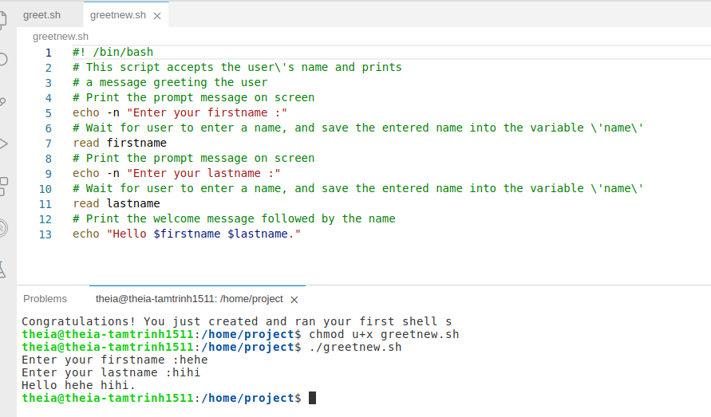
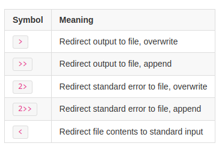
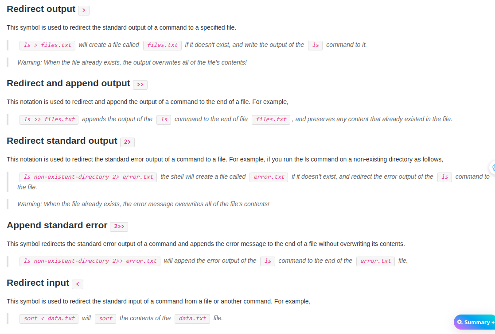
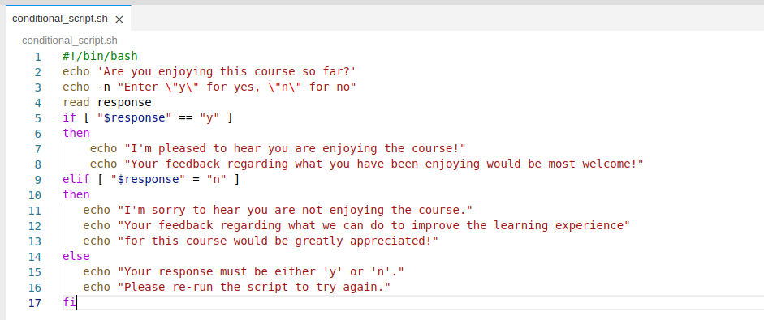
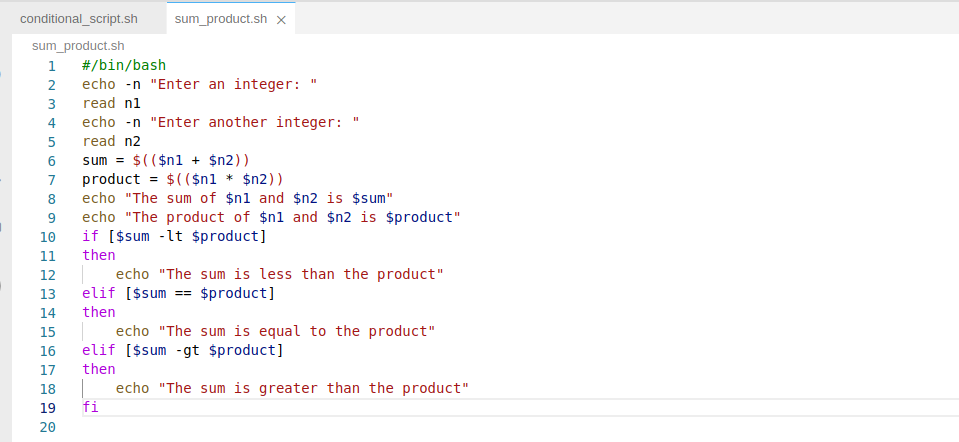
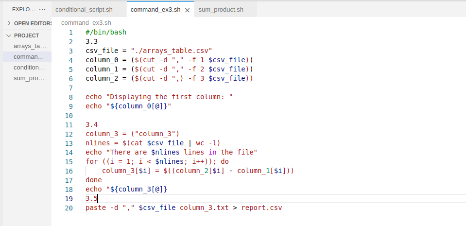

1. Reading: A Brief Introduction to Shell Variables
```
$> firstname=Jeff
$> echo $firstname
Jeff
firstname=Jeff
$> echo $firstname
Jeff
```
2. Hands-on Lab: Getting Started with Shell Scripting
- Exercise 1
```
1.1: Create a new script file
1.2
$> ls -l greet.sh 
-rw-r--r-- 1 theia users 518 Sep  5 22:03 greet.sh
$>  bash greet.sh
Enter your name :Tammy
Welcome Tammy
Congratulations! You just created and ran your first shell script using Bash on IBM Skills Network
```
- Exercise 2:
```
2.1
which bash
/bin/bash
2.2: Edit the script
2.3
chmod +x greet.sh
$>  chmod u+x greet.sh
$>  ls -l greet.sh
-rwxr-xr-x 1 theia users 531 Sep  5 22:05 greet.sh
2.4
$> ./greet.sh
Enter your name :Tammy
Welcome Tammy
Congratulations! You just created and ran your first shell script using Bash on IBM Skills Network
```
- Practice Exercise
```

```
3. Reading: Examples of Pipes \n
- Pipe examples 
```
$> cat pets.txt
goldfish
dog
cat
parrot
dog
goldfish
goldfish
$> sort pets.txt
cat
dog
dog
goldfish
goldfish
goldfish
parrot
$> uniq pets.txt
goldfish
dog
cat
parrot
dog
goldfish
$> sort pets.txt | uniq
cat
dog
goldfish
parrot
```
- Applying a command to strings and files
```
$> echo "Linux and shell scripting are awesome\!" | tr "aeiou" "_"
L_n_x _nd sh_ll scr_pt_ng _r_ _w_s_m_!
$> echo "Linux and shell scripting are awesome\!" | tr -c "aeiou" "_"
_i_u__a_____e______i__i___a_e_a_e_o_e_
cat pets.txt | tr "[a-z]" "[A-Z]"
GOLDFISH
DOG
CAT
PARROT
DOG
GOLDFISH
GOLDFISH
$> sort pets.txt | uniq | tr "[a-z]" "[A-Z]"
CAT
DOG
GOLDFISH
PARROT
```
- Extracting information from URLs
```
$> curl -s --location --request GET https://api.coinstats.app/public/v1/coins/bitcoin\?currency\=USD |\
    grep -oE "\"price\":\s*[0-9]*?\.[0-9]*"
"price": 57907.78008618953
$> curl -s --location --request GET https://api.coinstats.app/public/v1/coins/bitcoin\?currency\=USD |\
    grep -oE "\"price\":\s*[0-9]*?\.[0-9]*" |\
    grep -oE "[0-9]*?\.[0-9]*"
57907.78008618953
```


4. Reading: Examples of Bash Shell Features
*: wildcard character to represent any sequence of characters  ```ls *.txt``` \n
?: a wildcard character to represent any single character. ```ls file?.txt``` \n
Backslash : an escape character. It instructs the shell to preserve the literal interpretation of special characters such as space, tab, and $ \n
```touch file\ with\ space.txt```
- Input/output redirection


Command Substitution
```
$>  here = $(pwd)
$>  cd path_to_some_other_directory
$> cd $here
```
5. Reading: Introduction to Advanced Bash Scripting
```
```
6. Hands-on-Lab: Advanced Bash Scripting
- Exercise 1
```
1.1
$> echo '#/bin/bash' > conditional_script.sh
$>  chmod u+x conditional_script.sh 
1.2 + 1.3

```
- Exercise 2
```
$> echo '#/bin/bash' > sum_product.sh

```
- Exercise 3
```
3.1
$> csv_file="https://cf-courses-data.s3.us.cloud-object-storage.appdomain.cloud/IBM-LX0117EN-SkillsNetwork/labs/M3/L2/arrays_table.csv"
$>  wget $csv_file
--2023-09-07 02:18:47--  https://cf-courses-data.s3.us.cloud-object-storage.appdomain.cloud/IBM-LX0117EN-SkillsNetwork/labs/M3/L2/arrays_table.csv
Resolving cf-courses-data.s3.us.cloud-object-storage.appdomain.cloud (cf-courses-data.s3.us.cloud-object-storage.appdomain.cloud)... 169.63.118.104
Connecting to cf-courses-data.s3.us.cloud-object-storage.appdomain.cloud (cf-courses-data.s3.us.cloud-object-storage.appdomain.cloud)|169.63.118.104|:443... connected.
HTTP request sent, awaiting response... 200 OK
Length: 54 [text/csv]
Saving to: ‘arrays_table.csv’

arrays_table.csv              100%[=================================================>]      54  --.-KB/s    in 0s      

2023-09-07 02:18:47 (5.48 MB/s) - ‘arrays_table.csv’ saved [54/54]
3.3
$> cat arrays_table.csv 
column_0,column_1,column_2
1,2,3
4,5,6
7,8,9
10,11,12
3.4
echo '#/bin/bash' > command_ex3.sh


```
7. Hands-on Lab: Scheduling Jobs using Crontab
- Exercise 2 
```
$> crontab -l
no crontab for theia
```
- Exercise 3
```
3.1 
$> crontab -e
no crontab for theia - using an empty one
crontab: installing new crontab
$>  crontab -l
# Edit this file to introduce tasks to be run by cron.
# 
# Each task to run has to be defined through a single line
# indicating with different fields when the task will be run
# and what command to run for the task
# 
# To define the time you can provide concrete values for
# minute (m), hour (h), day of month (dom), month (mon),
# and day of week (dow) or use '*' in these fields (for 'any').# 
# Notice that tasks will be started based on the cron's system
# daemon's notion of time and timezones.
# 
# Output of the crontab jobs (including errors) is sent through
# email to the user the crontab file belongs to (unless redirected).
# 
# For example, you can run a backup of all your user accounts
# at 5 a.m every week with:
# 0 5 * * 1 tar -zcf /var/backups/home.tgz /home/
# 
# For more information see the manual pages of crontab(5) and cron(8)
# 
# m h  dom mon dow   command
0 21 * * * echo "Welcome to cron" >>/tmp/echo.txt

3.2 
$> echo '#! bin/bash' > diskusage.sh
$>  chmod u+x diskusage.sh 
sh diskusage.sh 
Thu Sep  7 03:12:06 EDT 2023
Filesystem      Size  Used Avail Use% Mounted on
overlay          98G   55G   39G  60% /
tmpfs            64M     0   64M   0% /dev
tmpfs            16G     0   16G   0% /sys/fs/cgroup
/dev/vda2        98G   55G   39G  60% /etc/hosts
shm              64M     0   64M   0% /dev/shm
tmpfs            28G   16K   28G   1% /run/secrets/kubernetes.io/serviceaccount
tmpfs            16G     0   16G   0% /proc/acpi
tmpfs            16G     0   16G   0% /proc/scsi
tmpfs            16G     0   16G   0% /sys/firmware
crontab -e
crontab: installing new crontab
$>  crontab -l
# Edit this file to introduce tasks to be run by cron.
# 
# Each task to run has to be defined through a single line
# indicating with different fields when the task will be run
# and what command to run for the task
# 
# To define the time you can provide concrete values for
# minute (m), hour (h), day of month (dom), month (mon),
# and day of week (dow) or use '*' in these fields (for 'any').# 
# Notice that tasks will be started based on the cron's system
# daemon's notion of time and timezones.
# 
# Output of the crontab jobs (including errors) is sent through
# email to the user the crontab file belongs to (unless redirected).
# 
# For example, you can run a backup of all your user accounts
# at 5 a.m every week with:
# 0 5 * * 1 tar -zcf /var/backups/home.tgz /home/
# 
# For more information see the manual pages of crontab(5) and cron(8)
# 
# m h  dom mon dow   command
0 21 * * * echo "Welcome to cron" >>/tmp/echo.txt
0 0 * * * /home/project/diskusage.sh >>/home/project/diskusage.log

```
- Exercise 4: 
```
$> rontab -r
$>  crontab -l
no crontab for theia
```


