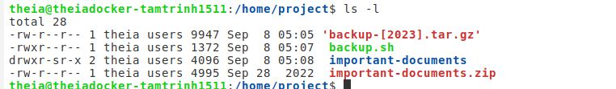

1. Hands-on Lab: Historical Weather Forecast Comparision to Actuals
- Exercise 1
```
$> touch rx_poc.log
$> echo -e "year\tmonth\tday\thour\tobs_tmp\tfc_temp">rx_poc.log
```
- Exercise 2
```
2.1
$> touch rx_poc.sh 
$> chmod u+x rx_poc.sh
2.2
$> today=$(date +%Y%m%d)
$>  weather_report=raw_data_$today
$>  city=Casablanca 
$>  curl wttr.in/$city --output $weather_report
  % Total    % Received % Xferd  Average Speed   Time    Time     Time  Current
                                 Dload  Upload   Total   Spent    Left  Speed
100  9162  100  9162    0     0  17385      0 --:--:-- --:--:-- --:--:-- 17418
```
- Exercise 3:
```
3.1 
$> grep °C $weather_report > temperatures.txt
$> obs_tmp=$(cat -A temperatures.txt | head -1 | cut -d "+" -f2 | cut -d "^" -f1 )
$>  echo "observed temperature = $obs_tmp"
observed temperature =   
$> fc_temp=$(cat -A temperatures.txt |head -3| tail -1| cut -d "+" -f2|cut -d "(" -f1|cut -d "^" -f1)
3.2 
$> hour=$(TZ='Morocco/Casablanca' date -u +%H)
$>  day=$(TZ='Morocco/Casablanca' date -u +%d)
$>  month=$(TZ='Morocco/Casablanca' date +%m)
$>  year=$(TZ='Morocco/Casablanca' date +%Y)
3.3
$> record=$(echo -e "$year\t$month\t$day\t$obs_tmp\t$fc_temp")
$>  echo $record>>rx_poc.log

```
- Exercise 4
```
$> date 
Fri Sep  8 04:31:28 EDT 2023
$>  date -u
Fri Sep  8 08:31:31 UTC 2023
$>  crontab -e
no crontab for theia - using an empty one
crontab: installing new crontab
$>  crontab -l
# Edit this file to introduce tasks to be run by cron.
# 
# Each task to run has to be defined through a single line
# indicating with different fields when the task will be run
# and what command to run for the task
# 
# To define the time you can provide concrete values for
# minute (m), hour (h), day of month (dom), month (mon),
# and day of week (dow) or use '*' in these fields (for 'any').# 
# Notice that tasks will be started based on the cron's system
# daemon's notion of time and timezones.
# 
# Output of the crontab jobs (including errors) is sent through
# email to the user the crontab file belongs to (unless redirected).
# 
# For example, you can run a backup of all your user accounts
# at 5 a.m every week with:
# 0 5 * * 1 tar -zcf /var/backups/home.tgz /home/
# 
# For more information see the manual pages of crontab(5) and cron(8)
# 
# m h  dom mon dow   command
0 8 * * * /home/project/rx_poc.sh
```
- Exercise 5
```
5.1 
$> echo -e "year\tmonth\tday\tobs_tmp\tfc_temp\taccuracy\taccuracy_range" > historical_fc_accuracy.tsv
$> touch fc_accuracy.sh
5.2
#! /bin/bash

yesterday_fc=$(tail -2 rx_poc.log | head -1 | cut -d " " -f5)
today_temp=$(tail -1 rx_poc.log | cut -d " " -f4)
accuracy=$(($yesterday_fc-$today_temp))

echo "accuracy is $accuracy"

if [ -1 -le $accuracy ] && [ $accuracy -le 1 ]
then
           accuracy_range=excellent
elif [ -2 -le $accuracy ] && [ $accuracy -le 2 ]
   then
               accuracy_range=good
       elif [ -3 -le $accuracy ] && [ $accuracy -le 3 ]
       then
                   accuracy_range=fair
           else
                       accuracy_range=poor
fi

echo "Forecast accuracy is $accuracy_range"

row=$(tail -1 rx_poc.log)
year=$( echo $row | cut -d " " -f1)
month=$( echo $row | cut -d " " -f2)
day=$( echo $row | cut -d " " -f3)
echo -e "$year\t$month\t$day\t$today_temp\t$yesterday_fc\t$accuracy\t$accuracy_range" >> historical_fc_accuracy.tsv

```
- Exercise 6
```
$> wget https://cf-courses-data.s3.us.cloud-object-storage.appdomain.cloud/IBMSkillsNetwork-LX0117EN-Coursera/labs/synthetic_historical_fc_accuracy.tsv
--2023-09-08 04:48:00--  https://cf-courses-data.s3.us.cloud-object-storage.appdomain.cloud/IBMSkillsNetwork-LX0117EN-Coursera/labs/synthetic_historical_fc_accuracy.tsv
Resolving cf-courses-data.s3.us.cloud-object-storage.appdomain.cloud (cf-courses-data.s3.us.cloud-object-storage.appdomain.cloud)... 169.63.118.104
Connecting to cf-courses-data.s3.us.cloud-object-storage.appdomain.cloud (cf-courses-data.s3.us.cloud-object-storage.appdomain.cloud)|169.63.118.104|:443... connected.
HTTP request sent, awaiting response... 200 OK
Length: 263 [text/tab-separated-values]
Saving to: ‘synthetic_historical_fc_accuracy.tsv’

synthetic_historical_fc_ 100%[===============================>]     263  --.-KB/s    in 0s      

2023-09-08 04:48:00 (36.6 MB/s) - ‘synthetic_historical_fc_accuracy.tsv’ saved [263/263]

$>  touch command_e6.sh
#!/bin/bash

echo $(tail -7 synthetic_historical_fc_accuracy.tsv  | cut -f6) > scratch.txt

week_fc=($(echo $(cat scratch.txt)))

# validate result:
for i in {0..6}; do
    echo ${week_fc[$i]}
done

for i in {0..6}; do
  if [[ ${week_fc[$i]} < 0 ]]
  then
    week_fc[$i]=$(((-1)*week_fc[$i]))
  fi
  # validate result:
  echo ${week_fc[$i]}
done

minimum=${week_fc[1]}
maximum=${week_fc[1]}
for item in ${week_fc[@]}; do
   if [[ $minimum > $item ]]
   then
     minimum=$item
   fi
   if [[ $maximum < $item ]]
   then
     maximum=$item
   fi
done

echo "minimum ebsolute error = $minimum"
echo "maximum absolute error = $maximum"
```

2. Hands-On Lab: Peer-Graded Final Project
```
Task 15
$> chmod u+x backup.sh 
$>  ls -l backup.sh
Task 16
$> wget https://cf-courses-data.s3.us.cloud-object-storage.appdomain.cloud/IBM-LX0117EN-SkillsNetwork/labs/Final%20Project/important-documents.zip
--2023-09-08 05:04:49--  https://cf-courses-data.s3.us.cloud-object-storage.appdomain.cloud/IBM-LX0117EN-SkillsNetwork/labs/Final%20Project/important-documents.zip
Resolving cf-courses-data.s3.us.cloud-object-storage.appdomain.cloud (cf-courses-data.s3.us.cloud-object-storage.appdomain.cloud)... 169.63.118.104
Connecting to cf-courses-data.s3.us.cloud-object-storage.appdomain.cloud (cf-courses-data.s3.us.cloud-object-storage.appdomain.cloud)|169.63.118.104|:443... connected.
HTTP request sent, awaiting response... 200 OK
Length: 4995 (4.9K) [application/zip]
Saving to: ‘important-documents.zip’

important-documents.zip         100%[======================================================>]   4.88K  --.-KB/s    in 0s      

2023-09-08 05:04:49 (544 MB/s) - ‘important-documents.zip’ saved [4995/4995]

$>  unzip -DDo important-documents.zip
Archive:  important-documents.zip
   creating: important-documents/
  inflating: important-documents/zop.txt  
  inflating: important-documents/ana.txt  
  inflating: important-documents/doi.txt  
$>  touch important-documents/*
$> ./backup.sh important-documents .
targetDirectory is important-documents
destinationDirectory is .
ana.txt
doi.txt
zop.txt
mv: 'backup-1694164080.tar.gz' and './backup-1694164080.tar.gz' are the same file

Task 17
$> sudo cp backup.sh /usr/local/bin/
$>  crontab -e
no crontab for theia - using an empty one
crontab: installing new crontab
$>  crontab -l
# Edit this file to introduce tasks to be run by cron.
# 
# Each task to run has to be defined through a single line
# indicating with different fields when the task will be run
# and what command to run for the task
# 
# To define the time you can provide concrete values for
# minute (m), hour (h), day of month (dom), month (mon),
# and day of week (dow) or use '*' in these fields (for 'any').# 
# Notice that tasks will be started based on the cron's system
# daemon's notion of time and timezones.
# 
# Output of the crontab jobs (including errors) is sent through
# email to the user the crontab file belongs to (unless redirected).
# 
# For example, you can run a backup of all your user accounts
# at 5 a.m every week with:
# 0 5 * * 1 tar -zcf /var/backups/home.tgz /home/
# 
# For more information see the manual pages of crontab(5) and cron(8)
# 
# m h  dom mon dow   command
*/1 * * * * /usr/local/bin/backup.sh /home/project/important-documents /home/project
$> sudo service cron start
 * Starting periodic command scheduler cron
   ...done.
$>  ls -a
 .   ..  'backup-[2023].tar.gz'   backup.sh   important-documents   important-documents.zip
$>  sudo service cron stop
 * Stopping periodic command scheduler cron
   ...done.
  Task 17
$> sudo cp backup.sh /usr/local/bin/
$>  crontab -e
no crontab for theia - using an empty one
crontab: installing new crontab
$>  crontab -l
# Edit this file to introduce tasks to be run by cron.
# 
# Each task to run has to be defined through a single line
# indicating with different fields when the task will be run
# and what command to run for the task
# 
# To define the time you can provide concrete values for
# minute (m), hour (h), day of month (dom), month (mon),
# and day of week (dow) or use '*' in these fields (for 'any').# 
# Notice that tasks will be started based on the cron's system
# daemon's notion of time and timezones.
# 
# Output of the crontab jobs (including errors) is sent through
# email to the user the crontab file belongs to (unless redirected).
# 
# For example, you can run a backup of all your user accounts
# at 5 a.m every week with:
# 0 5 * * 1 tar -zcf /var/backups/home.tgz /home/
# 
# For more information see the manual pages of crontab(5) and cron(8)
# 
# m h  dom mon dow   command
*/1 * * * * /usr/local/bin/backup.sh /home/project/important-documents /home/project
$> sudo service cron start
 * Starting periodic command scheduler cron
   ...done.
$>  ls -a
 .   ..  'backup-[2023].tar.gz'   backup.sh   important-documents   important-documents.zip
$>  sudo service cron stop
 * Stopping periodic command scheduler cron
   ...done.
  
```
